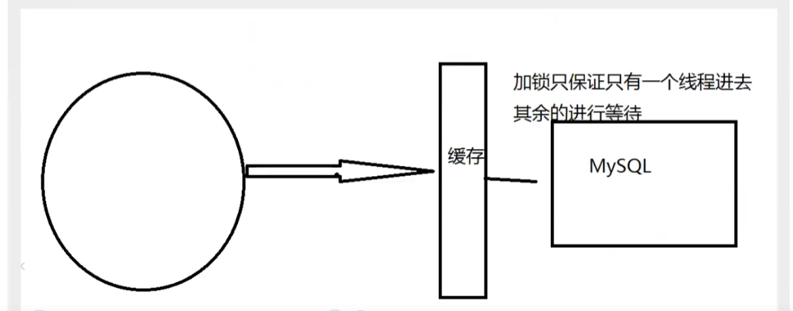

# **Redis**

## **一、Nosql**

### **为什么使用Nosql**

**大数据时代！！普通的数据库无法进行数据分析！Hadoop(2006)。**

**用户的个人信息，社交网络，地理位置，用户自己产生的数据，用户日志等等爆发式**

**增长，这是用无法再继续使用关系型数据库了**

**历史发展：**

> 1. **单机MySQL时代（90年代）,一个网站的访问量一般不会太大，单个数据库完全够用**
>
> ****
>
> **问题：**
>
> - **数据量增加到一定程度，单机数据库就放不下了**
> - **数据的索引（B+ Tree）,一个机器内存也存放不下**
> - **访问量变大后（读写混合），一台服务器承受不住。**
>
> 1. **MySQL垂直拆分+MemCache**
>
> ****
>
> **将当个数据库扩展成为多个“垂直”的数据库，同时满足读写分离和数据一致性。**
> **但是当访问量过大时频繁去数据库查询速度和效率低下。这个优化过程经历了以下几个过程:**
>
> - **优化数据库的数据结构和索引(难度大)**
> - **文件缓存，通过IO流获取比每次都访问数据库效率略高，但是流量爆炸式增长时候，IO流也承受不了**
> - **MemCache,当时最热门的技术，通过在数据库和数据库访问层之间加上一层缓存，第一次访问时查询数据库，将结果保存到缓存，后续的查询先检查缓存，若有直接拿去使用，效率显著提升。**
>
> 1. **分库分表、主从复制=>集群**
>
> ****
>
> 1. **如今信息量井喷式增长，各种各样的数据出现（用户定位数据，图片数据等），大数据的背景下关系型数据库（RDBMS）无法满足大量数据要求。Nosql数据库就能轻松解决这些问题。**

### **什么是Nosql**

**Not Only SQL、不仅仅是数据库。泛指非关系型数据库。**

**关系型数据库：列+行，同一个表下数据的结构是一样的。**

**非关系型数据库：数据存储没有固定的格式，并且可以进行横向扩展。**

### **Nosql特点**

1. **数据之间没有关系，方便扩展**
2. **大数据量下，性能高。（一秒写入8W次 读取11W次）**
3. **数据类型是多样性（不需要事先设计数据库，感受一下Mysql设计表和库的痛苦）**
4. **存储方式**
   - **键值对存储**
   - **列存储**
   - **文档存储**
   - **图形数据库**
   - **…**
5. **没有固定的查询语言** 
6. **CAP定理和 BASE**
7. **高可用、高性能、高可扩**
8. **传统的 RDBMS和NoSQL** 

```
传统的RDBMS
	关系数据库管理系统（Relational Database Management System：RDBMS）是指包括相互联系的逻辑组织和存取这些数据的一套程序 (数据库管理系统软件)。关系数据库管理系统就是管理关系数据库，并将数据逻辑组织的系统。
常用的关系数据库管理系统产品是Oracle、IBM的DB2和微软的SQL Server。

特点
-结构化组织
-SQL
-数据和关系都存在的单独的表中 row col  行和列
-操作，数据定义语言
-严格的一致性
-基础的事务
-......
```

````
Nosql
	NoSQL最常见的解释是“non-relational”， “Not Only SQL”也被很多人接受。NoSQL仅仅是一个概念，泛指非关系型的数据库，区别于关系数据库，它们不保证关系数据的ACID特性。NoSQL是一项全新的数据库革命性运动，其拥护者们提倡运用非关系型的数据存储，相对于铺天盖地的关系型数据库运用，这一概念无疑是一种全新的思维的注入。
NoSQL有如下优点：易扩展，NoSQL数据库种类繁多，但是一个共同的特点都是去掉关系数据库的关系型特性。数据之间无关系，这样就非常容易扩展。无形之间也在架构的层面上带来了可扩展的能力。大数据量，高性能，NoSQL数据库都具有非常高的读写性能，尤其在大数据量下，同样表现优秀。这得益于它的无关系性，数据库的结构简单。 [1]

特点
- 不仅仅是数据库
- 没有固定的查询语言
- 键值对存储，列存储，文档存储，图形数据库（社交关系）
- CAP定理和BASE （异地多活） 
- 高性能，高可用，高可扩
````

### **了解 3V 和 3高**

**大数据时代的3V:主要是描述问题的**

​	**1.海量Volume  ------访问量 ，一小时爆发100万的阅读用户，一秒用户的存储访问量非常的多**

​	**2.多样性Variety   ------聊天信息，位置信息，**

​	**3.实时性Velocity  ------列如：4g 时代 直播的是有延迟。5g时代就不一定了**

**大数据时代的3高：主要是对程序的要求**

​	**1.高并发** 

​	**2.高可拓**

​	**3.高性能**  


**总的来说：NoSQL 和 RDBMS 并不会拆开使用，实际的公司项目这个俩个都在用**


**推荐阅读：阿里云的这群疯子https://yq.aliyun.com/articles/653511 认真阅读需要40分钟**

```markdown
                一个简单的淘宝页面 它的数据来源于下面的技术栈
# 商品信息
- 一般存放在关系型数据库：Mysql,阿里巴巴使用的Mysql都是经过内部改动的。
- Mysql内部是支持热拔插的，低层和正常使用的就不一样了

# 商品描述、评论(文字居多)
- 文档型数据库：MongoDB

# 图片
- 分布式文件系统 FastDFS
- 淘宝：TFS
- Google: GFS
- Hadoop: HDFS
- 阿里云: oss

# 商品关键字 用于搜索
- 搜索引擎：solr,elasticsearch
- 阿里淘宝：Isearch 大牛：多隆 一个人开发了这个Isearch搜索引擎
 
# 商品热门的波段信息（缓存）
- 内存数据库：Redis，Memcache，Tair

# 商品交易，外部支付接口
- 第三方应用
12345678910111213141516171819202122
```

**所以企业中使用数据库，都是关系型数据库+Nosql一起使用。**

### **NoSQL的四大分类**

#### **KV键值对**

- **sina：Redis**
- **美团：Redis+Tair**
- **alibaba、baidu：Redis+Memcache**

#### **文档型数据库（bson格式和JSON一样的）**

- **MongoDB(掌握)**

  > **基于分布式文件存储的数据库。C++编写，用于处理大量文档。**

  **MongoDB是RDBMS和NoSQL的中间产品。NoSQL中最像关系型数据库的数据库**

  **MogoDB是一个介于关系型数据库和非关系型数据的中间件的产品，MongoDB是非关系型数据库中，最丰富，最像关系型数据库的**

- **ConchDB（国外的）**

#### **列存储数据库**

- **HBase(大数据必学)**
- **分布式文件系统**

#### **图关系数据库**

**不是存放图形的，是存放关系的，用于广告推荐，社交网络，朋友圈**

- **Neo4j、InfoGrid**

| **分类**                | **Examples举例**                                       | **典型应用场景**                                             | **数据模型**                                        | **优点**                                                     | **缺点**                                                     |
| ----------------------- | ------------------------------------------------------ | ------------------------------------------------------------ | --------------------------------------------------- | ------------------------------------------------------------ | ------------------------------------------------------------ |
| **键值对（key-value）** | **Tokyo Cabinet/Tyrant, Redis, Voldemort, Oracle BDB** | **内容缓存，主要用于处理大量数据的高访问负载，也用于一些日志系统等等。** | **Key 指向 Value 的键值对，通常用hash table来实现** | **查找速度快**                                               | **数据无结构化，通常只被当作字符串或者二进制数据**           |
| **列存储数据库**        | **Cassandra, HBase, Riak**                             | **分布式的文件系统**                                         | **以列簇式存储，将同一列数据存在一起**              | **查找速度快，可扩展性强，更容易进行分布式扩展**             | **功能相对局限**                                             |
| **文档型数据库**        | **CouchDB, MongoDb**                                   | **Web应用（与Key-Value类似，Value是结构化的，不同的是数据库能够了解Value的内容）** | **Key-Value对应的键值对，Value为结构化数据**        | **数据结构要求不严格，表结构可变，不需要像关系型数据库一样需要预先定义表结构** | **查询性能不高，而且缺乏统一的查询语法。**                   |
| **图形(Graph)数据库**   | **Neo4J, InfoGrid, Infinite Graph**                    | **社交网络，推荐系统等。专注于构建关系图谱**                 | **图结构**                                          | **利用图结构相关算法。比如最短路径寻址，N度关系查找等**      | **很多时候需要对整个图做计算才能得出需要的信息，而且这种结构不太好做分布式的集群** |


# **Redis入门**

## **概述**

- **什么是Redis？**

  **Redis（Rmote Dictionary Server）远程字典服务**

  **是一个免费开源使用的ANSI C语言编写、支持网络，可基于内存亦可持久化的日志型、Key-Value数据库，并提供多种语言的API。**

  **NoSQL 技术之一，也叫结构化数据库**

- **Redisj能做什么**

  - **内存存储，持久化，内存中是断电就没有了，持久化的术语:rdb和aof**
  - **效率高，可以用于高速缓存**
  - **发布订阅系统**
  - **地图信息分析**
  - **计数器，计时器（浏览量！）**

- **Redis 特性**

  - **多样化的数据类型**

  - **持久化**

  - **集群**

  - **事务**

    **。。。**

- **学习工具**

  - **redis官网 和中文网**
  - **GitHub开源网站**
  - **狂胜的公众号**


## **Windows 安装**

**Windows的Redis安装包非常的小巧 只有 5M 的是版本停留在 3.2.0 而Linux已经快6.0.0了**

**windows下Redis 的默认端口是 ：6379**   


> **1.Redis 压缩包下的文件**

****F:\Redis\Windows-Redis\Redis-x64-3.2.100\*\***

1.  **redis-service.exe 启动服务**
2. **redis-cli.exe 是客户端**
3. **redis-check-aof.exe 检查持久化文件是否是可用的**
4. **redis-benchmark.exe 测试性能的**


> **2.使用Redis**

- **打开 redis-server.exe 运行服务器** 

- **打开 redis-cli.exe 运行客户端 连接服务器 （需要先打开服务器）**

- **在客户端 下输入: ping**

```Redis
127.0.0.1:6379> ping
PONG
```

**PONG代表连接成功**


- **保存数据：redis 是以键值对方式进行存储的 类似于java Map** 

```
127.0.0.1:6379> set name zhangsan
OK
```


- **读取数据**

```readis
127.0.0.1:6379> get name
"zhangsan"
```

 **Redis推荐使用liunx服务器上搭建，Windows 上的基本停更**

## **Linux 安装**

**下载Linux的Redis 安装包**

**解压使用**

> **1.基本的环境：**

​	**make命令将 所有的Redis 的文件放置在了**

​	**usr/local/bin 目录下  ，这个目录下就有Redis的文件**

```
yum install gcc-c++
make #获取所有的文件
make install #需要管理员权限
```


**防止出现不可挽回的操作：**

```linux
mkdir 自定义目录 #默认是在当前目录下生成
mkdir /xx/xx/自定义目录 #指定文件下生成
touch xxx.text  #生成一个文件

cp /Redis解压目录/redis.config 自定义目录 
```

**将redis.config文件复制一份到自定义目录中，在之后的操作只使用这个文件即可**


> **redis.conf 配置**

****

```
firewall-cmd --query-port=6379/tcp #开启端口号6379
```


- **redis 默认不是后台启动的需要修改配置**

  ```
  daemonize no #修改成yes 
  daemonize yes
  
  ```

  

- **启动服务**

```bash
redis-server /usr/redis/redis.conf #启动服务
redis-cli -h -p 6379 #启动客户端  -h 代表loalhost  -p 代表端口

127.0.0.1:6379> ping
PONG
127.0.0.1:6379> set name zhangsan
OK
127.0.0.1:6379> get name  #获取name的 value
"zhangsan"

#查看进程
[root@localhost bin]# ps -ef |grep redis
root      68992      1  0 11:30 ?        00:00:00 redis-server 127.0.0.1:6379
root      69159  63432  0 11:36 pts/0    00:00:00 grep --color=auto redis

#关闭redis 服务
[root@localhost bin]# redis-cli -p 6379
127.0.0.1:6379> shutdown
not connected>  #表示已经关闭
```


## **Redis-benchmark**

**Redis-benchmark 测试 redis的性能**


**语法：redis-beanchmark -xxx**

| **选项**  | **描述**                                       | **默认值**    |
| --------- | ---------------------------------------------- | ------------- |
| **-h**    | **指定服务器主机名**                           | **127.0.0.1** |
| **-p**    | **指定服务器端口**                             | **6379**      |
| **-s**    | **指定服务器 socket**                          |               |
| **-c**    | **指定并发连接数**                             | **50**        |
| **-n**    | **指定请求数**                                 | **10000**     |
| **-d**    | **以字节的形式指定 SET/GET 值的数据大小**      | **2**         |
| **-k**    | **1=keep alive 0=reconnect**                   | **3**         |
| **-r**    | **SET/GET/INCR 使用随机 key, SADD 使用随机值** |               |
| **-P**    | **通过管道传输 <numreq> 请求**                 | **1**         |
| **-q**    | **强制退出 redis。仅显示 query/sec 值**        |               |
| **--csv** | **以 CSV 格式输出**                            |               |
| **-l**    | **生成循环，永久执行测试**                     |               |
| **-t**    | **仅运行以逗号分隔的测试命令列表**             |               |
| **-I**    | **Idle 模式。仅打开 N 个 idle 连接并等待**     |               |

- **简单的测试；**

```bash
#测试：主机：lcoalhost 端口号：6379 并发：100  请求：100000
root@localhost bin]# redis-benchmark -h localhost -p 6379 -c 100 -n 100000

测试的数据：

===== PING_MBULK ======                                                   
  100000 requests completed in 1.00 seconds  ——对十万个请求进行写入测试
  100 parallel clients ——一百个并发测试
  3 bytes payload ——每次写入3个字节
  keep alive: 1 ——单机性能，一台服务器处理请求测试
  host configuration "save": 3600 1 300 100 60 10000  
  host configuration "appendonly": no ——不是主配置（reids.conf）
  multi-thread: no ——不是多线程
  
  Latency by percentile distribution: --百分比测试
0.000% <= 0.135 milliseconds (cumulative count 2) 
50.000% <= 0.463 milliseconds (cumulative count 54827) ——在0.463毫秒内处理了 50%的请求
75.000% <= 0.535 milliseconds (cumulative count 75813)
87.500% <= 0.671 milliseconds (cumulative count 87577)
93.750% <= 0.919 milliseconds (cumulative count 93764)
96.875% <= 1.431 milliseconds (cumulative count 96903)
98.438% <= 1.823 milliseconds (cumulative count 98452)
99.219% <= 2.127 milliseconds (cumulative count 99227)
99.609% <= 2.423 milliseconds (cumulative count 99613)
99.805% <= 2.775 milliseconds (cumulative count 99805)
99.902% <= 3.015 milliseconds (cumulative count 99904)
99.951% <= 3.143 milliseconds (cumulative count 99953)
99.976% <= 3.295 milliseconds (cumulative count 99976)
99.988% <= 3.447 milliseconds (cumulative count 99988)
99.994% <= 3.607 milliseconds (cumulative count 99994)
99.997% <= 3.719 milliseconds (cumulative count 99997)
99.998% <= 3.775 milliseconds (cumulative count 99999)
99.999% <= 3.831 milliseconds (cumulative count 100000)
100.000% <= 3.831 milliseconds (cumulative count 100000)

```

## **Redis的基础知识**

> **Redis默认有16个数据库**

**Redis是一个字典结构的存储服务器，一个Redis实例提供了多个用来存储数据的字典，客户端可以指定将数据存储在哪个字典中。这与在一个关系数据库实例中可以创建多个数据库类似，所以可以将其中的每个字典都理解成一个独立的数据库。**

```bash

# Set the number of databases. The default database is DB 0, you can select
# a different one on a per-connection basis using SELECT <dbid> where
# dbid is a number between 0 and 'databases'-1
databases 16

#使用select 选择数据库 默认是第0个
127.0.0.1:6379> select 3 #选择数据库
OK
127.0.0.1:6379[3]> dbsize #查看大小
(integer) 0
127.0.0.1:6379[3]> set name zhangsan #保存字符
OK
127.0.0.1:6379[3]> dbsize
(integer) 1
127.0.0.1:6379[3]> select 1
OK
127.0.0.1:6379[1]> get name
(nil)
127.0.0.1:6379[1]> select 3
OK
127.0.0.1:6379[3]> get name
"zhangsan"

127.0.0.1:6379[3]> keys * #代表查看所有的key
1) "name"

127.0.0.1:6379[3]> flushdb #清空当前库所有的key
OK

127.0.0.1:6379[3]> flushall #清空所有的数据库
OK

```


> ## **问题：Redis的端口号是6379**

**6379在是手机按键上MERZ对应的号码，而MERZ取自意大利歌女[Alessia Merz](http://it.wikipedia.org/wiki/Alessia_Merz)的名字。MERZ长期以来被antirez及其朋友当作愚蠢的代名词。[Redis](http://blog.nosqlfan.com/tags/redis)作者antirez同学在twitter上说将在下一篇博文中向大家解释为什么他选择[6379](http://blog.nosqlfan.com/tags/6379)作为[默认](http://blog.nosqlfan.com/tags/默认)[端口](http://blog.nosqlfan.com/tags/端口)号。而现在这篇博文出炉，在解释了Redis的LRU机制之后，向大家解释了采用6379作为默认端口的原因。**

**##** 

> ## **重点:**

- **Readis 是单线程的**
- **Redis是基于内存操作，CPU不是Redis性能瓶颈，Redis的瓶颈是机器的内存和网络宽**

- **Redis 是C语言写的，官方提供的数据为十万+的[QPS](https://baike.sogou.com/v55024868.htm?fromTitle=QPS)，完全不比Memecache差**
- **区别：高性能的数据库不一定是多线程的？多线程不一定比单线程高！**
- **Redis的核心是：将所有的数据全部存放在内存的，所以单线程去操作效率最高**


**但是Redis在6.0以上的版本是多线程的；**

****

****

# **Reids 的基本命令**

> **判断：EXISTS KEY**

- **判断库中的KEY是否存在**

```bash
127.0.0.1:6379> set name zhansan #添加key value
OK

127.0.0.1:6379> get name #获取 key 的value
"zhansan"

27.0.0.1:6379> set age 12
OK
127.0.0.1:6379> keys *  #获取所有的 value
1) "age"
2) "name"

127.0.0.1:6379> EXISTS name # true 返回 1
(integer) 1
127.0.0.1:6379> EXISTS age
(integer) 1

127.0.0.1:6379> EXISTS albb  #false 返回0
(integer) 0

```


> **移动：move key  db_index  将key 移动到指定数据库中**

```bash
127.0.0.1:6379> move name 1 #将name 移动到索引为1的数据库中
(integer) 1
127.0.0.1:6379> get name  #在当前的数据库获取name 提示没有
(nil)
127.0.0.1:6379> select 1 #选择进入索引为1的数据中
OK
127.0.0.1:6379[1]> get name  #获取key的value 可以成功获取到
"zhansan"
127.0.0.1:6379[1]> select 2 #
OK
127.0.0.1:6379[2]> get name
(nil)

```


> **自动过期： EXPIRE key  s   key将在 s秒后自动删除 ——单位是秒/s**

- **ttl key  ：查看key所剩的时间**

```bash
127.0.0.1:6379[1]> set name zhangsan
OK
127.0.0.1:6379[1]> get name
"zhangsan"
127.0.0.1:6379[1]> EXPIRE name 15
(integer) 1
127.0.0.1:6379[1]> ttl name #距离自动删除还有9秒
(integer) 9
127.0.0.1:6379[1]> ttl name  #已经删除了 返回-2
(integer) -2
127.0.0.1:6379[1]> ttl name
(integer) -2
127.0.0.1:6379[1]> get name  #获取失败
(nil)

```

​	**常用于热点信息，热点新闻，Cooking，做缓存使用**


> **查看类型：type kye**

```bash
127.0.0.1:6379[1]> set name lishi
OK
127.0.0.1:6379[1]> get name 
"lishi"
127.0.0.1:6379[1]> type name
string
127.0.0.1:6379[1]> set age 333
OK
127.0.0.1:6379[1]> get age
"333"
127.0.0.1:6379[1]> type age
string

```


**官方更多命令：[https://redis.io/commands](https://redis.io/commands)**


# **Reids的数据类型**

> **Redis支持五种数据类型：string（字符串），hash（哈希），list（列表），set（集合）及zset(sorted set：有序集合)。**

## **官方说明：**

```bash
Redis 是一个开源（BSD许可）的，内存中的数据结构存储系统，它可以用作数据库、缓存和消息中间件。 它支持多种类型的数据结构，如 字符串（strings）， 散列（hashes）， 列表（lists）， 集合（sets）， 有序集合（sorted sets） 与范围查询， bitmaps， hyperloglogs 和 地理空间（geospatial） 索引半径查询。 Redis 内置了 复制（replication），LUA脚本（Lua scripting）， LRU驱动事件（LRU eviction），事务（transactions） 和不同级别的 磁盘持久化（persistence）， 并通过 Redis哨兵（Sentinel）和自动 分区（Cluster）提供高可用性（high availability）。
```


## **五大数据类型**


### **String**

> **string（字符串）类似于java String**

- **追加字符串**

  - ```bash
    127.0.0.1:6379[1]> set name zhang #
    OK
    127.0.0.1:6379[1]> get name
    "zhang"
    127.0.0.1:6379[1]> APPEND name san  #返回添加后的长度
    (integer) 8
    127.0.0.1:6379[1]> get name
    "zhangsan"
    
    ```

- **incr(自增)&decr(自减)** 

  ```bash
  127.0.0.1:6379[1]> set i 0
  OK
  127.0.0.1:6379[1]> get i
  "0"
  127.0.0.1:6379[1]> incr i  #每次执行+1
  (integer) 1
  127.0.0.1:6379[1]> incr i
  (integer) 2
  127.0.0.1:6379[1]> get i
  "2"
  127.0.0.1:6379[1]> incr i
  (integer) 3
  127.0.0.1:6379[1]> get i
  "3"
  127.0.0.1:6379[1]> decr i #每次执行减1
  (integer) 2
  127.0.0.1:6379[1]> get i
  "2"
  127.0.0.1:6379[1]> decr i
  (integer) 1
  127.0.0.1:6379[1]> get i
  "1"
  
  ```

  - **INCRBY 一次加10&DECRBY 一次减10 专业术语：步长**

  ```bash
  127.0.0.1:6379[1]> INCRBY i 10 #执行+10
  (integer) 11
  127.0.0.1:6379[1]> get i
  "11"
  127.0.0.1:6379[1]> INCRBY i 5
  (integer) 16
  
  127.0.0.1:6379[1]> DECRBY i 10  #执行-10
  (integer) 6
  127.0.0.1:6379[1]> get i
  "6"
  127.0.0.1:6379[1]> DECRBY i 5
  (integer) 1
  
  ```

  **可用于 播放量，点赞。。。。**

- **GetRange(截取字符串)**

  - ```bash
    127.0.0.1:6379[1]> set str zhansanAixiaohong
    OK
    127.0.0.1:6379[1]> get str
    "zhansanAixiaohong"
    127.0.0.1:6379[1]> GETRANGE str 0 6  #截取字符串 下标从0开始
    "zhansan"
    127.0.0.1:6379[1]> get str  #不会从新保存
    "zhansanAixiaohong"
    
    127.0.0.1:6379[1]> GETRANGE str 0 -1 #这个一个闭区间 ，获取所有的字符串 
    "zhansanAixiaohong"
    
    ```

- **SetRange(替换字符串)**

  - ```bash
    127.0.0.1:6379[1]> set str1 abcdefg
    OK
    127.0.0.1:6379[1]> get str1
    "abcdefg"
    127.0.0.1:6379[1]> setRange str1 3 222  #下标从开始，替换‘d’ 为222
    (integer) 7
    127.0.0.1:6379[1]> get str1
    "abc222g"
    
    ```

  

- **Setex(设置key 指定 过期时间 初始化value)**

  - ```bash
    127.0.0.1:6379[1]> set name zhangsan
    OK
    127.0.0.1:6379[1]> get name
    "zhangsan"
    127.0.0.1:6379[1]> setex name 30 "wangwu" #设置过期时间、初始化value
    OK
    127.0.0.1:6379[1]> get name #会覆盖原先value
    "wangwu"
    127.0.0.1:6379[1]> ttl name #距离过期结束还有18秒
    (integer) 18
    127.0.0.1:6379[1]> ttl name
    (integer) 16
    127.0.0.1:6379[1]> keys * #查看所有的key
    1) "name"
    127.0.0.1:6379[1]> ttl name
    (integer) 4
    127.0.0.1:6379[1]> keys *  
    (empty array)
    127.0.0.1:6379[1]> ttl name #key 已过期 返回 -2
    (integer) -2
    127.0.0.1:6379[1]> get name #无法在获取到
    (nil)
    
    ```

  

- **Setnx()：不存在就添加key value**

  - ```bash
    127.0.0.1:6379[1]> set name zhangsan
    OK
    127.0.0.1:6379[1]> get name
    "zhangsan"
    127.0.0.1:6379[1]> Setnx name wangwu #key 已经存在 返回0，结果没有覆盖
    (integer) 0
    127.0.0.1:6379[1]> get name
    "zhangsan"
    127.0.0.1:6379[1]> get age  #未添加key
    (nil)
    127.0.0.1:6379[1]> Setnx age 33 #key 不存在就添加 返回1
    (integer) 1
    127.0.0.1:6379[1]> get age #成功添加
    "33"
    
    ```

    **常用于分布式锁**

- **mset（一次设置多个值）**

  - ```bash
    127.0.0.1:6379[1]> mset str1 zhangsan str2 wangwu str3 zaoliu str4 tianqi #key value key vaue 这样设置
    OK
    127.0.0.1:6379[1]> keys *
    1) "str3"
    2) "str4"
    3) "str2"
    4) "str1"
    
    ```

    

- **mget（一次获取指定多个值）**

  - ```bash
    127.0.0.1:6379[1]> mget str1 str2 str3 str4
    1) "zhangsan"
    2) "wangwu"
    3) "zaoliu"
    4) "tianqi"
    127.0.0.1:6379[1]> mget str1 str2 str3
    1) "zhangsan"
    2) "wangwu"
    3) "zaoliu"
    
    ```


### **List**

**所有的命令都是以 L 或者 l 开头的**

**list列表中可以有多个重复的值**

**左边是头**  

**右边是尾**

> **list（列表）**
>
> **常用于数据结构：栈，队列，阻塞队列**

- **Lpush&Lrange (key start end ) 添加一个值或者多个值**

  - **Lpush key value ....（在左边插入一个值或者多个值）**

    - ```bash
      127.0.0.1:6379> lpush list one  #添加 key 的value one
      (integer) 1
      127.0.0.1:6379> lpush list tow
      (integer) 2
      127.0.0.1:6379> lrange list 0 -1  # 获取了list列表的素有值
      1) "tow"
      2) "one"
      
      ```

      

  - **Renge key value ....(在右边插入一个值或者多个值，这个一个双端的队列)**

    - ```bash
      127.0.0.1:6379> Rpush list 1234 #在右边插入
      (integer) 4
      127.0.0.1:6379> lrange list 0 -1 # 获取0 到 -1 之间的值（所有）
      1) "three"
      2) "tow"
      3) "one"
      4) "1234"
      127.0.0.1:6379> lpush list 1111 #在左边插入
      (integer) 5
      127.0.0.1:6379> lrange list 0 -1
      1) "1111"
      2) "three"
      3) "tow"
      4) "one"
      5) "1234"
      
      ```

- **（移除命令）** 

  - **Lpop  key (移除左边第一个)**

  - **Rpop key (移除左边第一个)**

    - ```bash
      127.0.0.1:6379> lrange list 0 -1 #获取当前所有的list 列表值
      1) "1111"
      2) "three"
      3) "tow"
      4) "one"
      5) "1234"
      127.0.0.1:6379> lpop list  #移除左边第一个
      "1111"
      127.0.0.1:6379> rpop list #移除左边第一个
      "1234"
      127.0.0.1:6379> lrange list 0 -1
      1) "three"
      2) "tow"
      3) "one"
      
      ```

  - **Lrem key count value  (移除指定值)**

    - ```bash
      127.0.0.1:6379> lrange list 0 -1
      1) "two"
      2) "one"
      3) "abdc"
      4) "three"
      5) "two"
      6) "one"
      127.0.0.1:6379> Lrem list 1 one  #移除key为 list value为one 一个值
      (integer) 1
      127.0.0.1:6379> lrange list 0 -1 # 左边的one 被移除了
      1) "two"
      2) "abdc"
      3) "three"
      4) "two"
      5) "one"
      127.0.0.1:6379> Lrem list 2 two #移除 key为list value为two 的两个值
      (integer) 2
      127.0.0.1:6379> lrange list 0 -1
      1) "abdc"
      2) "three"
      3) "one"
      
      ```

    ****

- **获取value的下标位置**

  - **lindex list index**

    - ```bash
      127.0.0.1:6379> lrange list 0 -1
      1) "three"
      2) "tow"
      3) "one"
      127.0.0.1:6379> lindex list 2
      "one"
      127.0.0.1:6379> lindex list 1
      "tow"
      
      ```

  -  **获取长度**

    - ```bash
      127.0.0.1:6379> Lpush list one two three abdc
      (integer) 4
      127.0.0.1:6379> lrange list 0 -1
      1) "abdc"
      2) "three"
      3) "two"
      4) "one"
      127.0.0.1:6379> Llen list
      (integer) 4
      ```

- **截取指定的长度**

  - **Ltrim key start end** 

    - ```bash
      127.0.0.1:6379> LRange list 0 -1 #获取当前list所有的列表
      1) "tianqi"
      2) "zhaoliu"
      3) "wangwu"
      4) "lishi"
      5) "zhangsan"
      127.0.0.1:6379> Ltrim list 2 3 #获取（截取 ） 2-3 长度 
      OK
      127.0.0.1:6379> LRange list 0 -1 #只剩下 wangwu 和lishi
      1) "wangwu"
      2) "lishi"
      
      ```

- **移除最后一个元素，并添加到另一个list列表中**

  - **rpoplpush listKey1 listKey2**

    - ```bash
      127.0.0.1:6379> Lpush list1 a b c d e f g h #添加多个元素
      (integer) 8
      127.0.0.1:6379> Lrange list1 0 -1 #获取 list1 所有元素
      1) "h"
      2) "g"
      3) "f"
      4) "e"
      5) "d"
      6) "c"
      7) "b"
      8) "a"
      127.0.0.1:6379> rpoplpush list1 list2 #将list1的最后一个元素移出，并添加到list2列表中
      "a"
      127.0.0.1:6379> Lrange list1 0 -1 #元素a 已经不见了
      1) "h"
      2) "g"
      3) "f"
      4) "e"
      5) "d"
      6) "c"
      7) "b"
      127.0.0.1:6379> Lrange list2 0 -1 #元素a 在 list2中
      1) "a"
      
      ```

- **修个list列表的值和判断key 是否存在**

  - **lset key index value**

    - **如果不存在就报错**

    - ```bash
      127.0.0.1:6379> Rpush list zhangsan lishi wangwu zhaoliu #尾部添加多个元素
      (integer) 4
      127.0.0.1:6379> Lrange list 0 -1  #获取list列表所有的值
      1) "zhangsan"
      2) "lishi"
      3) "wangwu"
      4) "zhaoliu"
      127.0.0.1:6379> lset list 1 1234  #修改 key为list 下标位置为1 value修改为 1234 
      OK
      127.0.0.1:6379> Lrange list 0 -1 #修改成功
      1) "zhangsan"
      2) "1234"
      3) "wangwu"
      4) "zhaoliu"
      
      ```

  - **EXISTS key**

    - ```bash
      127.0.0.1:6379> Exists list #判断key 存在返回1
      (integer) 1
      127.0.0.1:6379> Exists list2 #不存在返回0
      (integer) 0
      127.0.0.1:6379> Exists list2 list3 #不存在返回0
      (integer) 0
      127.0.0.1:6379> Exists list2 list #只有一个是存在的返回 1
      (integer) 1
      127.0.0.1:6379> Exists list list2 # 并不是返回下标
      (integer) 1
      127.0.0.1:6379> Lpush list4 a b c #添加listKey value
      (integer) 3
      127.0.0.1:6379> Exists list list4 #判断多个 存在返回存在数量
      (integer) 2
      127.0.0.1:6379> Exists list list4 lsit3 lsit2 #判断多个 存在返回存在数量
      (integer) 2
      
      ```

- **在 list列表 前后插入一个值** 

  - **LInsert key before|After value newValue** 

    - **如果value值相同会插入在 第一个 的 前后**

    - ```bash
      127.0.0.1:6379> Lpush list a b c d e f g   #插入多个value
      (integer) 7
      127.0.0.1:6379> Lrange list 0 -1 #获取list列表
      1) "g"
      2) "f"
      3) "e"
      4) "d"
      5) "c"
      6) "b"
      7) "a"
      127.0.0.1:6379> Linsert list before "g" 1234 #在元素 “g” 的前面添加 "1234" (可以不添加“”)
      (integer) 8
      127.0.0.1:6379> Lrange list 0 -1
      1) "1234"
      2) "g"
      3) "f"
      4) "e"
      5) "d"
      6) "c"
      7) "b"
      8) "a"
      127.0.0.1:6379> Linsert list After "e" zhangsan #在元素 “e" 后面添加 zhangsan 
      (integer) 9
      127.0.0.1:6379> Lrange list 0 -1
      1) "1234"
      2) "g"
      3) "f"
      4) "e"
      5) "zhangsan"
      6) "d"
      7) "c"
      8) "b"
      9) "a"
      
      ```


> **List 总结：**

- **List 是一个链表Node，before ，after，left，right （前后左右）都可以插入值**
- **如果key不存在会创建新的链表**
- **如果key存在，新增内容**
- **如果移除了所有的value，空链表，代表不存在**
- **在两边（头尾）插入修改值效率最高，中间插入修改相对效率低一些**

**List常用于：消息队列，消息排队，栈**


### **Set**

> **set（集合）**
>
> **特点：**
>
> - **value不能重复** 
> - **插入|保存 没有顺序**


- **添加和查看set 列表|集合，判断某一个key下是否存在该值**

  - **sadd key value ....**
  - **Smembers key**
  - **Sismember key value**

  ````bash
  127.0.0.1:6379> sadd set1 a b c d e  #多个 set元素
  (integer) 5 
  127.0.0.1:6379> Smembers set1 #获取 set1 集合
  1) "c"
  2) "a"
  3) "b"
  4) "d"
  5) "e"
  127.0.0.1:6379> Sismember set1 a  #set 集合 value为a 存在返回 1
  (integer) 1
  127.0.0.1:6379> Sismember set1 zhangsan #et 集合 value为zhansan 不存在返回0
  (integer) 0
  
  ````

- **获取set集合元素个数，指定移除某一元素**

  - **scard key**

    - ```bsh
      127.0.0.1:6379> scard set1 #获取key 为 set1 的元素个数
      (integer) 5
      
      ```

  - **srem key value**

    - ```BASH
      127.0.0.1:6379> Smembers set1 #查看key 为 set1 的集合
      1) "d"
      2) "a"
      3) "c"
      4) "b"
      5) "e"
      127.0.0.1:6379> srem set1 a  #移除value 为 a 的元素
      (integer) 1
      127.0.0.1:6379> scard set1  #查看 key为 set1 的元素个数
      (integer) 4
      127.0.0.1:6379> srem set1 b c d  #同时移除多个 元素
      (integer) 3
      127.0.0.1:6379> scard set1 #set1集合还剩下 一个元素
      (integer) 1
      127.0.0.1:6379> Smembers set1 #查看剩下元素
      1) "e"
      
      ```

- **随机获取key 中的value**

  - **SrandMemberkey count|**

    - ```bash
      27.0.0.1:6379> sadd set1 zhangsan lishi wangwu zhaoliu tianqi #添加多个value
      (integer) 5
      127.0.0.1:6379> Smembers set1 #获取kye为 set1 的集合
      1) "zhaoliu"
      2) "lishi"
      3) "wangwu"
      4) "zhangsan"
      5) "tianqi"
      127.0.0.1:6379> SRANDMEMBER set1  #随机获取一个 key 为 set1 的value
      "tianqi"
      127.0.0.1:6379> SRANDMEMBER set1 
      "zhangsan"
      127.0.0.1:6379> SRANDMEMBER set1
      "wangwu"
      
      127.0.0.1:6379> SrandMember set1 2  #随机获取多个值
      1) "tianqi"
      2) "zhaoliu"
      127.0.0.1:6379> SrandMember set1 2
      1) "tianqi"
      2) "lishi"
      127.0.0.1:6379> SrandMember set1 2
      1) "wangwu"
      2) "zhangsan"
      
      ```
      
      **常用于好友列表：A用户将所有关注的添加到set集合中，他的粉丝也放在集合中！共同关注、共同爱好、二度好友、推荐好友**
      
      **（六度分割理论）**
      
      


### **Hash**

> **hash（哈希）**
>
> **Map集合 key:[key:value]  (类似于JSON数据)**

- **创建Map 集合和获取Map集合**

  - **hset  key key value**

  - **hget  key key**

    - ```bash
      127.0.0.1:6379> hset mMap name zhagsan #添加mMap集合 key为 name value为 zhagsan
      (integer) 1
      127.0.0.1:6379> hget mMap name #获取mMap集合中 key为name value
      "zhagsan"
      
      ```

  - **hmset key value...  一次设置多个key value**

  - **hmget key key ....一次获取多个 key中的vlaue**

    - ```bash
      127.0.0.1:6379> hmset mMap name zhangsan age 13 addsser beijing
      OK
      127.0.0.1:6379> hmget mMap name age addsser
      1) "zhangsan"
      2) "13"
      3) "beijing"
      
      ```

    - 

  - **hgetall Mapkey 获取有的map集合**

    - ```bash
      127.0.0.1:6379> hgetall mMap # 获取Map集合中所有key value
      1) "name"
      2) "zhangsan"
      3) "zhaoliu"
      4) "tianqi"
      5) "age"					#key 下面是它的多个value值
      6) "13"
      7) "addsser"				#key
      8) "beijing"
      
      ```

  - **hdel Mapkey key 删除指定的key对应的value也会消失**

    - **可连续删除多个**

    - ```bash
      27.0.0.1:6379> hdel mMap age
      (integer) 1
      127.0.0.1:6379> hgetall mMap
      1) "addsser"
      2) "beijing"
      
      ```

  - **hlen Mapkey 获取mapkey 的长度**

    

    - ```bash
      127.0.0.1:6379> hgetall mMap
       1) "addsser"
       2) "beijing"
       3) "name"
       4) "zhaoliu"
       5) "str"
       6) "a"
       7) "str2"
       8) "b"
       9) "str3"
      10) "c"
      127.0.0.1:6379> hlen mMap #返回长度
      (integer) 5
      
      ```

  - **hkeys Mapkey  获取mapkey 中的所有key**

  - **hvals Mapkey 获取mapkey中的所有value**

    - ```bash
      127.0.0.1:6379> hkeys mMap 
      1) "addsser"
      2) "name"
      3) "str"
      4) "str2"
      5) "str3"
      127.0.0.1:6379> hvals mMap
      1) "beijing"
      2) "zhaoliu"
      3) "a"
      4) "b"
      5) "c"
      
      ```

- **HINCRBY Mapkey key 量 指定增量**

  - ```bash
    27.0.0.1:6379> hset myhash field 5 #添加Mapkey key vlaue为5
    (integer) 1
    127.0.0.1:6379> hgetall myhash  #查看key 和value
    1) "field"
    2) "5"
    127.0.0.1:6379> hincrby myhash field 1 #指定在Mapkey为 myhash 可以
    为 field 增加1（自增1）
    (integer) 6
    127.0.0.1:6379> hgetall myhash #发生了变化
    1) "field"
    2) "6"
    127.0.0.1:6379> hincrby myhash field -1 #-1 就是减1 返回对应的值
    (integer) 5
    127.0.0.1:6379> hgetall myhash
    1) "field"
    2) "5"
    
    ```

- **hsetnx Mapkey key value  (判断 Mapkey 中 key 是否有value这个值 如果没有 就添加：如果有就返回0)**

  - ```bash
    127.0.0.1:6379> hgetall myhash #查看map集合
    1) "field"
    2) "5"
    127.0.0.1:6379> hsetnx myhash field 5 
    (integer) 0
    127.0.0.1:6379> hsetnx myhash field 6
    (integer) 0
    127.0.0.1:6379> hsetnx myhash field2 6
    (integer) 1
    127.0.0.1:6379> hgetall myhash
    1) "field"
    2) "5"
    3) "field2"
    4) "6"
    
    ```

**Hash 合适存储 一些变更的数据|对象，列入：用户的个人数据 Use：rMapkey name：key  value：zhangsan  ageKey:value:14.....**


### **Zset**

> **zset(sorted set：有序集合) 在set基础增加了一个值  score1**


- **添加一个值&添加多个值**

  - **zadd setkey index value**

    - ```bash
      127.0.0.1:6379> zadd set1 1 a #一个值
      (integer) 1
      127.0.0.1:6379> zadd set1 2 b 
      (integer) 1
      127.0.0.1:6379> zadd set1 3 c 5 d 6 e 7 f # 添加多个值
      (integer) 4
      127.0.0.1:6379> ZRange set1 0 -1 # 列出所有的值
      1) "a"
      2) "b"
      3) "c"
      4) "d"
      5) "e"
      6) "f"
      
      ```

- **排序**

  - **ZRangeByScoure key min max**

    - ```bash
      K
      127.0.0.1:6379> zadd set1 1000 zhangsan #添加元素
      (integer) 1
      127.0.0.1:6379> zadd set1 2000 lishi
      (integer) 1
      127.0.0.1:6379> zadd set1 3000 wangwu
      (integer) 1
      127.0.0.1:6379> zadd set1 4000 zhaoliu
      (integer) 1
      127.0.0.1:6379> ZRangeByScore set1 -inf +inf #更具key为set1 负无穷 到正无穷 （小到大，这个条语句是取范围而不是排序）
      1) "zhangsan"
      2) "lishi"
      3) "wangwu"
      4) "zhaoliu"
      127.0.0.1:6379> ZRangeByScore set1 500 10000 #（取值范围）
      1) "zhangsan"
      2) "lishi"
      3) "wangwu"
      4) "zhaoliu"
      ```

  - **ZRevRange Zkey  0 -1 从大到小**

  - **ZRangeByScore set1 -inf 10000 withscores**

    - ```bash
      
      127.0.0.1:6379> ZRANGEBYSCORE set1 -inf 10000 withscores
      #排序条件 key为set1 负无穷到 2500 之间 显示所有的key value
      1) "zhangsan"
      2) "1000"
      3) "lishi"
      4) "2000"
      5) "wangwu"
      6) "3000"
      7) "zhaoliu"
      8) "4000"
      
      
      ```

- **移除Zset集合中的某一元素**

  - **zrem key value**

    - ```bash
      127.0.0.1:6379> zrange set1 0 -1 #列出所有key
      1) "zhangsan"
      2) "lishi"
      3) "wangwu"
      4) "zhaoliu"
      127.0.0.1:6379> zrem set1 lishi #删除key为 lishi的元素 成功返回1
      (integer) 1
      127.0.0.1:6379> zrange set1 0 -1 # 删除成功
      1) "zhangsan"
      2) "wangwu"
      3) "zhaoliu"
      
      ```

  - **zcard Zkey (获取集合中的元素个数)**

    - ```bash
      127.0.0.1:6379> zrange set1 0 -1 #列入所有的集合
      1) "zhangsan"
      2) "wangwu"
      3) "zhaoliu"
      127.0.0.1:6379> zcard set1 #获取有序集合的元素个数
      (integer) 3
      127.0.0.1:6379> zadd set 5000 lishi #添加有序集合的个数时 value key 且 value只能时数字类型 成功返回1
      (integer) 1
      127.0.0.1:6379> zcard set1 #发生变化
      (integer) 3
      
      ```

  - **zcount Zkey 范围 （获取指定区间的成员数量）**

    - ```bash
      127.0.0.1:6379> zrangebyscore set1 -inf 10000 withscores #获取zkey为set1的集合列表
      1) "zhangsan"
      2) "1000"
      3) "wangwu"
      4) "3000"
      5) "zhaoliu"
      6) "4000"
      127.0.0.1:6379> zcount set1 1000 3000 # 1000>=3000 之间数量，有2个满足
      (integer) 2
      127.0.0.1:6379> zcount set1 1000 10000
      (integer) 3
      127.0.0.1:6379> zcount set1 3000 10000
      (integer) 2
      
      ```


**Zset常用于：排行榜，成绩表，工资表**


**更多命令都在官方文档，这个文档只有基础的命令，常用的命令。**

**官方文档：https://redis.io/commands**


## **三种特殊数据类型**

> **Redis中的三种特殊数据类型**


### **geospatial**

> **地理位置**
>
> **定位朋友的距离，附近的人，打车距离计算**

**Redis GEO 主要用于存储地理位置信息，并对存储的信息进行操作，该功能在 Redis 3.2 版本新增。**

**本质像是添加一个集合**

**测试的数据：http://www.jsons.cn/lngcodeinfo/0706D99C19A781A3  测试城市的经纬度**

**事先把地图信息放到redis中就可准确的获取周围的信息，地理位置，附近的人**

**重点：geospatial的实现原理是Zset作的，可以使用Zset操作Geo,Zset 的语法可以在Geo中使用**


#### **Redis GEO 操作方法有六个命令：**

##### **geoadd**

> **：添加地理位置的坐标。**

1. **将指定的地理空间位置（纬度、经度、名称）添加到指定的`key`中。这些数据将会存储到`sorted set`这样的目的是为了方便使用[GEORADIUS](http://www.redis.cn/commands/georadius.html)或者[GEORADIUSBYMEMBER](http://www.redis.cn/commands/georadiusbymember.html)命令对数据进行半径查询等操作。**

2. **语法使用：geoadd key 经度 维度  名称**

3. ```bash
   
   #添加地理位置：key为 china：city 中国的城市
   # 经度 ：121.47 维度：31.23 是上海的地理位置
   127.0.0.1:6379> geoadd china:city 121.47 31.23 shanghai 
   (integer) 1
   
   #添加北京天安门的经度和维度信息
   127.0.0.1:6379> geoadd china:city 116.38 39.90   beijing_tiananmen
   (integer) 1
   
   #一次添加多个：           key		  经度    维度  城市名：天津 经度    维度   城市名：大同市
   127.0.0.1:6379> geoadd china:city 117.20 39.12 tianjing  113.30 40.08 taitontshi_datongshi
   (integer) 2
   ```

- **全球诸多个城市可以通过java程序读取配置文件一次性导入**
- **需要注意的是：南极和北极是无法之间添加的**
- **有效的经度从-180度到180度。**
- **有效的纬度从-85.05112878度到85.05112878度。**

----


##### **geopos**

> **：获取地理位置的坐标。**

1. **获取指定key的经度和维度**

2. **语法使用：geopos key 名称**

   ```bash
   127.0.0.1:6379> geopos china:city shanghai #获取的是坐标值
   1) 1) "121.47000163793563843"
      2) "31.22999903975783553"
   127.0.0.1:6379> geopos china:city beijing_tiananmen
   1) 1) "116.38000041246414185"
      2) "39.90000009167092543"
   
   ```

   

##### **geodist**

> **：计算两个位置之间的距离。**

1. **返回两个给定位置之间的距离。如果两个位置之间的其中一个不存在， 那么命令返回空值。  `GEODIST` 默认使用米作为单位。**

   1. **m 表示单位为米。**
   2. **km 表示单位为千米。**
   3. **mi 表示单位为英里。**
   4. **ft 表示单位为英尺。**

2. **语法使用：geodist key 名称  名称**

   ```bash
   
   #上海和天津之间的距离 "959286.3176"米
   127.0.0.1:6379> geodist china:city shanghai tianjing 
   "959286.3176"
   
   #使用千米作为单位
   127.0.0.1:6379> geodist china:city shanghai tianjing km 
   "959.2863"
   
   #不存在返回空值
   127.0.0.1:6379> geodist china:city shanghai tianjing2131 km
   (nil)
   ```

------


##### **georadius**

> ##### **：根据用户给定的经纬度坐标来获取指定范围内的地理位置集合。**
>
> **附近的人**

1. **以给定的经纬度为中心， 返回键包含的位置元素当中， 与中心的距离不超过给定最大距离的所有位置元素。**

2. **语法使用：georedius key 用户提供的经度 用户提供的维度   距离**

3. ```bash
   #寻找 用户提供的经度维度 500前面之间半径的城市
   #这个城市是包含在key中的
   127.0.0.1:6379> georadius china:city 121.47 31.23 500 km
   1) "shanghai"
   
   #在这个经度和维度100米的半径范围内含有 "shanghai" "tianjing" 这个俩个 城市
   127.0.0.1:6379> georadius china:city 121.47 31.23 1000 km
   1) "shanghai"
   2) "tianjing"
   127.0.0.1:6379> georadius china:city 121.47 31.23 10000 km
   1) "shanghai"
   2) "tianjing"
   3) "taitontshi_datongshi"
   4) "beijing_tiananmen"
   
   #添加 withcoord 可以查看坐标信息
   127.0.0.1:6379> georadius china:city 121 31 1000 km  withcoord
   1) 1) "shanghai"
      2) 1) "121.47000163793563843"
         2) "31.22999903975783553"
   2) 1) "tianjing"
      2) 1) "117.19999998807907104"
         2) "39.12000048819218279"
   
   #count 限制显示 多少数据
   127.0.0.1:6379> georadius china:city 121 31 1000 km  withcoord count2
   ```

   **找朋友**

------


##### **georadiusbymember**

> **：根据储存在位置集合里面的某个地点获取指定范围内的地理位置集合。**

1. **这个命令和 [GEORADIUS](http://www.redis.cn/commands/georadius.html) 命令一样， 都可以找出位于指定范围内的元素， 但是 `GEORADIUSBYMEMBER` 的中心点是由给定的位置元素决定的， 而不是像 [GEORADIUS](http://www.redis.cn/commands/georadius.html) 那样， 使用输入的经度和纬度来决定中心点**

   **指定成员的位置被用作查询的中心**

   **上面的命令坐标是坐标值决定**

   **这个命令是更具key中的城市来决定的**

2. **语法使用：geordiusbymember key 城市 距离 单位**

   ```bash
   #距离shanghai这个城市10000km内 key符合条件的
   127.0.0.1:6379> georadiusbymember china:city shanghai 10000 km 
   1) "shanghai"
   2) "tianjing"
   3) "taitontshi_datongshi"
   4) "beijing_tiananmen"
   
   
   ```

**找小区的周围的小区**

##### **geohash**

> **：返回一个或多个位置对象的 geohash 值。**

1. **返回一个或多个位置元素的 [Geohash](https://en.wikipedia.org/wiki/Geohash) 表示。**

   **通常使用表示位置的元素使用不同的技术，使用Geohash位置52点整数编码。由于编码和解码过程中所使用的初始最小和最大坐标不同，编码的编码也不同于标准。此命令返回一个标准的Geohash，在[维基百科](https://en.wikipedia.org/wiki/Geohash)和[geohash.org](http://geohash.org/)网站都有相关描述**

   **返回经纬度的字符串**

2. **语法使用：geohash**

   ```bash
   #返回经纬度的 11位geohash字符串，如果两个字符串越像，那么他们的距离就越接近
   127.0.0.1:6379> geohash china:city shanghai tianjing
   1) "wtw3sj5zbj0"
   2) "wwgqdcw6tb0"
   
   #添加 天津和平区
   127.0.0.1:6379> geoadd china:city 117.20 39.12 tianjing_hepingqu
   (integer) 1
   
   #添加 天津河东区
   127.0.0.1:6379> geoadd china:city 117.22 39.12 tianjing_hedongqu
   (integer) 1
   127.0.0.1:6379> geopos china:city tianjing_hepingqu tianjing_hedongqu
   1) 1) "117.19999998807907104"
      2) "39.12000048819218279"
   2) 1) "117.21999853849411011"
      2) "39.12000048819218279"
   
   #geohash这个两值非常接近
   127.0.0.1:6379> geohash china:city tianjing_hepingqu tianjing_hedongqu
   1) "wwgqdcw6tb0"
   2) "wwgqe3sfxb0"
   
   
   
   ```

**很少使用**


### **hyperloglog**

> **这个数据类型在Redis 2.8.9版本更新了Hpyerloglog数据结构**
>
> **什么是基数？**
>
> ​		**基数：不重复元素的元素数量（去重后的个数）**
>
> **作用：基数统计的算法**
>
> **优点：hyperlolo内存是固定的，2^64不同的元素的技术，只需要12kb内存，（有0.81%错误率！做UV任务，可以忽略不记）**
>
> ​		**网页UV（网站的访问数量）称之为UV，传统的统计一个人访问多次网站，算作一次访问量，使用est保存用户F的id，然后统计set集合中的元素个数作为评判标准**

#### **使用**

**所有的hyper数据类型语法使用：PF开头的命令**

- ##### **PFadd key element.... 添加一个或者多个元素**

```bash
#添加key为 hyper value为：zhansn... 如果不存就添加 ，存在就往后面追加
127.0.0.1:6379> PFadd hyper zhangsan lishi wnagwu zhaoliu tianqi wangba 
(integer) 1

127.0.0.1:6379> PFCount  hyper #统计基数元素个数
(integer) 11

 #再次添加key
127.0.0.1:6379> PFadd hyper2 a b c d e f
(integer) 1

#多个key统计元素个数
127.0.0.1:6379> PFcount  hyper hyper2 
(integer) 12


```


- ##### **PFmerge key  oldkye1 oldkey2  元素之间的并集**

```bash
127.0.0.1:6379> PFadd mykey a b c d e f g
(integer) 1
127.0.0.1:6379> PFCount mykey
(integer) 7
127.0.0.1:6379> PFadd mykey2 e f g w i #添加第二组元素
(integer) 1
127.0.0.1:6379> PFCount mykey2
(integer) 5

#将两个key之间不重复出现的元素 交给mykey3中
127.0.0.1:6379> PFmerge mykey3 myeky1 mykey2
OK

127.0.0.1:6379> PFCount mykey3
(integer) 5

```


**用于用户登录之后将其放入Hyperloglo类型中，用户可以重复**

**但是不影响统计效率**

### **bitmaps**

> **位运算 位存储 位图 的数据结构**
>
> **操作二进制来进行记录，只有0和1两个状态**

**统计用户信息：活跃，不活跃 ，登录， 未登录 ，打卡，未打卡**

**两个状态可以使用Bitmaps**


#### **测试使用**

**setbit key offset value**

**0 代表 未打卡：1代表已打卡**

```bash
#设置 key offset 状态  
127.0.0.1:6379> setbit sign 0 0 
(integer) 0
127.0.0.1:6379> setbit sign 1 1
(integer) 0
127.0.0.1:6379> setbit sign 2 0
(integer) 0
127.0.0.1:6379> setbit sign 3 1
(integer) 0
127.0.0.1:6379> setbit sign 4 0
(integer) 0
127.0.0.1:6379> setbit sign 5 1
(integer) 0
127.0.0.1:6379> setbit sign 6 1
(integer) 0

```


**查看某一天是否有打卡，查看状态**

```bash

127.0.0.1:6379> getbit sign 2
(integer) 0
127.0.0.1:6379> getbit sign 6
(integer) 1


#统计vlaue 是已打卡状态  
127.0.0.1:6379> bitCount sign
(integer) 4

```


## **事务**

> #### **MySQL中的事务ACID**
>
> - **[ACID](https://www.cnblogs.com/kismetv/p/10331633.html)**
>   - **要么同时成功,要么同时失败**
> - **回顾MySQL**
>
> ****
>
> **如上图所示，MySQL服务器逻辑架构从上往下可以分为三层：**
>
> **（1）第一层：处理客户端连接、授权认证等。**
>
> **（2）第二层：服务器层，负责查询语句的解析、优化、缓存以及内置函数的实现、存储过程等。**
>
> **（3）第三层：存储引擎，负责MySQL中数据的存储和提取。MySQL**中服务器层不管理事务，事务是由存储引擎实现的。**MySQL支持事务的存储引擎有InnoDB、NDB Cluster等，其中InnoDB的使用最为广泛；其他存储引擎不支持事务，如MyIsam、Memory等。**


### **Redis 事务的本质**

- **Redis的事务:**
  - **开启事务(命令:multi)**
  - **命令入队(set key value .....)**
  - **执行事务(命令:exec)**

- **Redis 事务的本质一组命令的集合,一个事务中的所有命令都会被序列化,,在事务执行过程中,会按照顺序执行**

  - ```bash
    #队列(先进先出)------------>set1
                              set2
                              set3
                              .....
    ```

- **Redis事务的特性**

  - **一次性(一次性执行完毕)**
  - **顺序性(事务执行按照顺序执行)**
  - **排他性(事务在执行过程中不允许被干扰)**


### **使用Redis事务**

> **正常使用Redis事务**

```bash
127.0.0.1:6379> multi #开启事务
OK
127.0.0.1:6379(TX)> set name zhngsan  #命令入队
QUEUED
127.0.0.1:6379(TX)> set age 34  #命令入队 
QUEUED
127.0.0.1:6379(TX)> set email zhngsan@qq.com
QUEUED
127.0.0.1:6379(TX)> exec  #执行事务
1) OK	#按照顺序执行
2) OK
3) OK

```

> **放弃事务**

- **DISCARD || discard**

```bash
127.0.0.1:6379> multi #开启事务
OK
127.0.0.1:6379(TX)> set anme zhangsan #命令入队
QUEUED
127.0.0.1:6379(TX)> set age 33
QUEUED
127.0.0.1:6379(TX)> set email lishi@qq.com
QUEUED
127.0.0.1:6379(TX)> discard #取消事务
OK
127.0.0.1:6379> get name  
"zhngsan"
127.0.0.1:6379> get age #没有发生改变
"34"
127.0.0.1:6379> get email
"zhngsan@qq.com"

```

> **编译时异常(代码有错误,命令有错),事务中的所有命令都不会被执行!**

```bash
127.0.0.1:6379> multi #开启事务
OK
127.0.0.1:6379(TX)> set k1 v1  #命令入队
QUEUED
127.0.0.1:6379(TX)> set k2 v2
QUEUED
127.0.0.1:6379(TX)> set k3 v3
QUEUED
127.0.0.1:6379(TX)> getset k3 v4
QUEUED
127.0.0.1:6379(TX)> getset k3  #不存在的语法 报出异常
(error) ERR wrong number of arguments for 'getset' command
127.0.0.1:6379(TX)> set k5 v5
QUEUED
127.0.0.1:6379(TX)> exec #执行事务
#事务处理失败
(error) EXECABORT Transaction discarded because of previous errors.
127.0.0.1:6379> get k1 #事务没有被执行,获取不到 key 为 k1的value值
(nil)
127.0.0.1:6379> get k3
(nil)

```


> **运行时异常 (如果事务队列中存在语法性错误,那么执行命令的时候,其他命令是可以正常执行的,错误命令抛出异常!)**

```bash
127.0.0.1:6379> set name zhangsan #设置key value
OK
127.0.0.1:6379> multi  #开启事务
OK
127.0.0.1:6379(TX)> incr name  #步长 每次执行+1  为 key为name的value值+1
QUEUED
127.0.0.1:6379(TX)> set age 22 #命令入队
QUEUED
127.0.0.1:6379(TX)> set email zhangsan@qq.com
QUEUED
127.0.0.1:6379(TX)> exec  #执行事务
#因为第一条命令value值不是Integer 所以报出运行时异常 这个条命令无法成功执行
1) (error) ERR value is not an integer or out of range  
2) OK  #不受错误影响,执行成功  
3) OK

127.0.0.1:6379> get name
"zhangsan"
127.0.0.1:6379> get age
"22"
127.0.0.1:6379> get email
"zhangsan@qq.com"


```

### **Redis监控! Watch**

> **重点:**
>
> **一但事务取消 ,监控(Watch)也着取消,无论成功还是失败监控(Watch),会在本次事务中失效**
>
> ​	**监控的对象在执行事务期间发生了变化,事务处理一定会失败**
>
> ​	**Redis可以实现乐观锁,watch本身就是乐观锁**


> **悲观锁**
>
> - **很悲观,认为什么都会和粗线问题,无论做什么,	都会枷锁**


> **乐观锁**
>
> - **很乐观,认为什么时候都不会出现问题,所以不会上锁! 在更新数据库的时候判断一下,在此期间是否有人修改过这个数据, (mysql使用 version字段)**
> - **获取Version**
> - **更新的时候比较version 是否一致性**


> **重点:**
>
> 1. **Redis单条命令是保持[原子性](https://www.cnblogs.com/jelly12345/p/14333863.html)的, 但是事务不保持原子性**
> 2. **Redis事务没有[隔离级别](https://www.cnblogs.com/jian-gao/p/10795407.html)的概念**
> 3. **所有命令在事务中,并没有直接被执行,只有发起执行命令的时候才会被执行**(列如:commit 提交事务才会执行事务)**


```bash
127.0.0.1:6379> set money 100 #设置钱包 内有 100元
OK
127.0.0.1:6379> set out 0 #花出去 0元
OK

127.0.0.1:6379> watch money  #监控这个 key(钱包)

127.0.0.1:6379> multi  #开启事务
OK
127.0.0.1:6379(TX)> decrBy money 20 
QUEUED
127.0.0.1:6379(TX)> incrBy out 20
QUEUED
127.0.0.1:6379(TX)> exec  #正常结束事务
1) (integer) 80
2) (integer) 20

```


**开启两个窗口测试: watch可以当作Redis的乐观锁使用**

```bash
#窗口一
127.0.0.1:6379> watch money #监控money对象
OK
127.0.0.1:6379> multi #开启事务
OK
127.0.0.1:6379(TX)> decrBy money 10 #步长-10
QUEUED
127.0.0.1:6379(TX)> get money #获取 value
QUEUED
127.0.0.1:6379(TX)> exec #执行之前在窗口而 修改 money的值
(nil) # 事务处理失败

#窗口二
127.0.0.1:6379> get money
"80"
127.0.0.1:6379> set money 100
OK

#事务处理失败,应该放弃监控(watch),获取最新的监控(watch):窗口一
127.0.0.1:6379> unwatch #放弃当前监控的对象
OK 
127.0.0.1:6379> watch money #重新监控 对象
OK
127.0.0.1:6379> multi
OK
127.0.0.1:6379(TX)> get money
QUEUED
127.0.0.1:6379(TX)> exec #对比监控的值发生了变化,如果没有变化,那么可以执行成功,如果值变了执行失败
1) "100"

#这是自旋锁
```


## **Jedis**

> **Jedis是官方推荐的java连接开发工具! 使用java操作中间件!**

- **创建Maven项目**

- **导入依赖**

```xml
<dependency>
      <groupId>redis.clients</groupId>
      <artifactId>jedis</artifactId>
      <version>3.5.1</version>
    </dependency>

    <dependency>
      <groupId>com.alibaba</groupId>
      <artifactId>fastjson</artifactId>
      <version>1.2.62</version>
    </dependency>
  </dependencies>
```


- **测试连接**

  ```java
  public class App {
      public static void main(String[] args) {
  
          Jedis jedis = new Jedis("127.0.0.1", 6379);
          //Redis的命令就是 Jedis的方法
          System.out.println(jedis.ping());
          
      }
  }
  
  ```


### **常用的api**

#### **RedisKey**

```java
 Jedis jedis = new Jedis("127.0.0.1", 6379);
        //Redis的命令就是 Jedis的方法
        System.out.println("是否连接成功:"+jedis.ping());
        System.out.println("判断某个key是否存在:"+jedis.exists("name"));
        System.out.println("清空所有key和value:"+jedis.flushAll());
        System.out.println("清空数据库key和value:"+jedis.flushDB());
        System.out.println("新增键对值:"+jedis.set("username","zhangsan"));
        System.out.println("新增键对值:"+jedis.set("age","34"));
        System.out.println("获取所有的key value:");
        Set<String> keys = jedis.keys("*");
        System.out.println(Arrays.toString(keys.toArray()));

        System.out.println("删除key:"+jedis.del("age"));
        System.out.println("判断key是否存在:"+jedis.exists("name"));
        System.out.println("查看key的value是什么存储类型:"+jedis.type("name"));
        System.out.println("随机返回key空间的一个:"+jedis.randomKey());
        System.out.println("重命名key:"+jedis.rename("username","name"));
        System.out.println("获取key:"+jedis.get("name"));
        System.out.println("按索引查询"+jedis.select(0));
        System.out.println("返回当前数据库中所有key的个数:"+jedis.dbSize());

```


**String**

```java

package com.yinghua;

import redis.clients.jedis.Jedis;

public class TestStringKey {
    public static void main(String[] args) {
        Jedis jedis = new Jedis();
        jedis.flushDB();
        System.out.println("----------------------------------------");
        System.out.println("设置key1 value1:"+jedis.set("key1","value1"));
        System.out.println("设置key2 value2:"+jedis.set("key2","value2"));
        System.out.println("设置key3 value3:"+jedis.set("key3","value3"));

        System.out.println("删除key2:"+jedis.del("key2"));
        System.out.println("获取key2:"+jedis.get("key2"));

        System.out.println("修改key1:"+jedis.set("key1","zhangsan"));
        System.out.println("获取key1的值:"+jedis.get("key1"));
        System.out.println("在key3后面加入值:"+jedis.append("key4","value4"));
        System.out.println("key3的值:"+jedis.get("key3"));
        System.out.println("增加多个key value"+jedis.mset("name1","lishi","name2","zaoliu","name3","tianqi"));
        System.out.println("获取多个key value"+jedis.mget("name1","name2","name3"));
        System.out.println("删除多个key value"+jedis.del("name1","name2","name3"));


        System.out.println(jedis.flushDB());
        System.out.println("====================新增key value对防止覆盖原先的值====================");
        System.out.println("key1 有值就取消,没有值就添加:"+jedis.setnx("key1","vlaue1"));
        System.out.println("key2 有值取消操作,没有值就添加:"+jedis.setnx("key2","value2"));
        System.out.println("key2:"+jedis.setnx("key2","value3"));


        System.out.println("----------------------------------------");
    }
}

```

**不写了,和命令一样的**

**Set**

**List**

**Hash**

**Zset**


#### **事务使用**

```java

import com.alibaba.fastjson.JSONObject;
import redis.clients.jedis.Jedis;
import redis.clients.jedis.Transaction;

public class Test事务 {
    public static void main(String[] args) {
        Jedis jedis = new Jedis("127.0.0.1",6379);

        jedis.flushDB();
        //准备数据
        JSONObject jsonObject = new JSONObject();
        jsonObject.put("name","zhangsan");
        jsonObject.put("age","231");
        String result = jsonObject.toJSONString();
        System.out.println(jsonObject.get("age"));

        //加上乐观锁,当result发生变化事务处理失败
        jedis.watch(result);

        //开启事务
        Transaction multi = jedis.multi();


        try {
            //抢夺数据
            jsonObject.put("age","123123123123123");

            Thread.sleep(1000);
            multi.set("user",result);
            multi.set("user2",result);


//            int i=1/0;// 测试失败的事务
            multi.exec();//执行事务
        }catch(Exception e){
            multi.discard();//放弃事务
            jedis.unwatch();//放弃监控获取最新的值
            e.printStackTrace();
        }
        finally {
            System.out.println(jedis.get("user"));
            System.out.println(jedis.get("user2"));
            jedis.close();//连接

        }
    }
}

```


## **SpringBoot整合**

**Spring-Data 操作 jpa jdbc mongodb redsi**

**StringBoot 与Spring-Data 其名的项目**

> **在SpringBoot2.x之后redis不再使用Jedis了**
>
> **而是使用:lettuce**
>
> - **Jedis:采用的直连,多个线程操作时不安全的,如果想要避免不安全的,使用jedis pool连接池! 更像 [BIo](https://www.jianshu.com/p/751fe1524a4b)模式**
> - **lettuce:采用了[netty](https://baike.baidu.com/item/Netty/10061624)网络请求框架,实例可以再多个线程中共享,不存在线程不安全的情况,可以减少线程数据  更像时 NIo模式**


```xml
   <!--引入了redis-->
    <dependency>
      <groupId>org.springframework.boot</groupId>
      <artifactId>spring-boot-starter-data-redis</artifactId>
      <version>2.4.3</version>
    </dependency>
```


**新建SpringBoot中找到Redis的自动配置类**

**spring-boot-autoconfigure-2.4.3.jar /META-INF/spring.factories 配置文件中自动配置了Redis**

```factories
org.springframework.boot.autoconfigure.data.redis.RedisAutoConfiguration,\
org.springframework.boot.autoconfigure.data.redis.RedisReactiveAutoConfiguration,\
org.springframework.boot.autoconfigure.data.redis.RedisRepositoriesAutoConfiguration,\

org.springframework.boot.autoconfigure.data.redis.RedisProperties   //Redis的配置类
```


**源码:**

```java
@Bean
@ConditionalOnMissingBean(name = "redisTemplate") //可以替换默认的 redisTemplate
@ConditionalOnSingleCandidate(RedisConnectionFactory.class)
public RedisTemplate<Object, Object> redisTemplate(RedisConnectionFactory redisConnectionFactory) {
   //默认的RedisTemplate 没有过的设置 redis对象需要序列化
   //两个泛型都是Object,Object的类型,强制类型转换(String,Object)
   RedisTemplate<Object, Object> template = new RedisTemplate<>();
   template.setConnectionFactory(redisConnectionFactory);
   return template;
}

@Bean
@ConditionalOnMissingBean
@ConditionalOnSingleCandidate(RedisConnectionFactory.class)
public StringRedisTemplate stringRedisTemplate(RedisConnectionFactory redisConnectionFactory) {
   StringRedisTemplate template = new StringRedisTemplate();
   template.setConnectionFactory(redisConnectionFactory);
   return template;
}
```


### **测试使用**

**application配置文件 配置Redis**

```yml
# 配置Redis
spring:
  redis:
    host: 127.0.0.1
    port: 6379
    #jedis 不在使用,源码里面没有注入成功
```


### **测试类**

```java

import org.junit.jupiter.api.Test;
import org.springframework.beans.factory.annotation.Autowired;
import org.springframework.boot.test.context.SpringBootTest;
import org.springframework.data.redis.connection.RedisConnection;
import org.springframework.data.redis.core.RedisTemplate;

@SpringBootTest
class DemoApplicationTests {
    @Autowired
    private RedisTemplate redisTemplate;

    @Test
    void contextLoads() {
        /**
         *  与命令一样的操作
         *       redisTemplate.opsForValue();  操作字符串
         *         redisTemplate.opsForList();
         *         redisTemplate.opsForSet();
         *         redisTemplate.opsForZSet();
         *         redisTemplate.opsForHash();
         *         redisTemplate.opsForGeo();
         *         redisTemplate.opsForHyperLogLog();
         * */

        //获取连接连接
        RedisConnection connection = redisTemplate.getConnectionFactory().getConnection();
        System.out.println(connection.ping());

        //添加key value
        redisTemplate.opsForValue().set("name","张三");

        //获取key value
        String name = (String) redisTemplate.opsForValue().get("name");
        System.out.println(name);

    }
}

```


**源码RedisTemplate 序列化设置**

```java
	@SuppressWarnings("rawtypes") private @Nullable RedisSerializer keySerializer = null;
	@SuppressWarnings("rawtypes") private @Nullable RedisSerializer valueSerializer = null;
	@SuppressWarnings("rawtypes") private @Nullable RedisSerializer hashKeySerializer = null;
	@SuppressWarnings("rawtypes") private @Nullable RedisSerializer hashValueSerializer = null;
	private RedisSerializer<String> stringSerializer = RedisSerializer.string();
```


**默认使用的是new JdkSerializationRedisSerializer JDK序列化 ,可以使用JSON序列化**

```java
defaultSerializer = new JdkSerializationRedisSerializer(
      classLoader != null ? classLoader : this.getClass().getClassLoader());
```


### **关于序列化**

**使用javaBean对象作为 Redis 中的 Key value 需要序列化(java中实现 implements Serializable)**

**或者使用JSON 作为 key value**

- **javaBean(使用了 lombok)**

  ```java
  import lombok.AllArgsConstructor;
  import lombok.Data;
  import lombok.NoArgsConstructor;
  import org.springframework.stereotype.Component;
  
  import java.io.Serializable;
  
  @Component
  @AllArgsConstructor
  @NoArgsConstructor
  @Data
  public class User implements Serializable {
  
      private String name;
      private String age;
  
  }
  ```

- **测试类**

  ```java
  @Test
  public void Test01() throws JsonProcessingException {
      User user = new User("luojiaju", "123");
  
      //对象转成JSON对象
      String jsonUser = new ObjectMapper().writeValueAsString(user);
  
      //设置String类型 key value
      //redisTemplate.opsForValue().set("user",jsonUser);
  
      redisTemplate.opsForValue().set("user",user);
  
      System.out.println(redisTemplate.opsForValue().get("user"));
  }
  ```

**控制台输出: 明显这个是一个 set集合的 key value**

```java
User(name=luojiaju, age=123)
```


**使用了JSON 作为 key value**

**控制台输出:**

```JSON
{"name":"luojiaju","age":"123"}
```


- **在企业中pojo都会序列化**


### **编写自定义的RedisTemplate**

```java
package com.yinghua.config;


import com.fasterxml.jackson.annotation.JsonAutoDetect;
import com.fasterxml.jackson.annotation.PropertyAccessor;
import com.fasterxml.jackson.databind.ObjectMapper;
import com.fasterxml.jackson.databind.jsontype.impl.LaissezFaireSubTypeValidator;
import org.springframework.context.annotation.Bean;
import org.springframework.context.annotation.Configuration;
import org.springframework.data.redis.connection.RedisConnectionFactory;
import org.springframework.data.redis.core.RedisTemplate;
import org.springframework.data.redis.serializer.Jackson2JsonRedisSerializer;
import org.springframework.data.redis.serializer.StringRedisSerializer;

/**
 * @author admin
 */
@Configuration
public class RedisConfig  {


    /**
     * 编写自定义的Redis模板(RedisTemplate)
     * 这个一个固定的模板,直接使用
     * */
    @Bean
    @SuppressWarnings("all")
    public RedisTemplate<String,Object> redisTemplate(RedisConnectionFactory redisConnectionFactory){
        RedisTemplate<String, Object> ort = new RedisTemplate<>();
       	ort.setConnectionFactory(redisConnectionFactory);
        /**
         * 配置具体的序列化方式:
         *  ByteArrayRedisSerializer
         *  GenericJackson2JsonRedisSerializer
         *  GenericToStringSerializer
         *  Jackson2JsonRedisSerializer
         *  JdkSerializationRedisSerializer
         *  OxmSerializer
         *  StringRedisSerializer
         * */
        //序列化配置
        Jackson2JsonRedisSerializer<Object> objectJackson2JsonRedisSerializer = new Jackson2JsonRedisSerializer<>(Object.class);

        ObjectMapper objectMapper = new ObjectMapper();
        objectMapper.setVisibility(PropertyAccessor.ALL, JsonAutoDetect.Visibility.ANY);
        objectMapper.activateDefaultTyping(LaissezFaireSubTypeValidator.instance, ObjectMapper.DefaultTyping.NON_FINAL);
        objectJackson2JsonRedisSerializer.setObjectMapper(objectMapper);


        //String 的序列化
        StringRedisSerializer stringRedisSerializer = new StringRedisSerializer();

        //key采用String的序列化方式
        ort.setKeySerializer(stringRedisSerializer);

        //hash的key使用String序列化
        ort.setHashKeySerializer(stringRedisSerializer);

        //value 序列化方式使用jackson
        ort.setValueSerializer(objectJackson2JsonRedisSerializer);

        //hash也采用 value序列化方式采用jacks
        ort.setHashKeySerializer(objectJackson2JsonRedisSerializer);

        //全部设置到位
        ort.afterPropertiesSet();

 
        return ort;

    }

}

```


### **编写RedisUtil**

```java
package com.yinghua.util;

import org.springframework.data.redis.core.RedisTemplate;
import org.springframework.stereotype.Component;
import org.springframework.util.CollectionUtils;

import javax.annotation.Resource;
import java.util.Collection;
import java.util.List;
import java.util.Map;
import java.util.Set;
import java.util.concurrent.TimeUnit;

@Component
public final class RedisUtil {

    @Resource
    private RedisTemplate<String, Object> redisTemplate;

    // =============================common============================

    /**
     * 指定缓存失效时间
     *
     * @param key  键
     * @param time 时间(秒)
     */
    public boolean expire(String key, long time, TimeUnit timeUnit) {
        try {
            if (time > 0) {
                redisTemplate.expire(key, time, timeUnit);
            }
            return true;
        } catch (Exception e) {
            e.printStackTrace();
            return false;
        }
    }

    /**
     * 根据key 获取过期时间
     *
     * @param key 键 不能为null
     * @return 时间(秒) 返回0代表为永久有效
     */
    public long getExpire(String key) {
        return redisTemplate.getExpire(key, TimeUnit.SECONDS);
    }


    /**
     * 判断key是否存在
     *
     * @param key 键
     * @return true 存在 false不存在
     */
    public boolean hasKey(String key) {
        try {
            return redisTemplate.hasKey(key);
        } catch (Exception e) {
            e.printStackTrace();
            return false;
        }
    }


    /**
     * 删除缓存
     *
     * @param key 可以传一个值 或多个
     */
    @SuppressWarnings("unchecked")
    public void del(String... key) {
        if (key != null && key.length > 0) {
            if (key.length == 1) {
                redisTemplate.delete(key[0]);
            } else {
                redisTemplate.delete((Collection<String>) CollectionUtils.arrayToList(key));
            }
        }
    }


    // ============================String=============================

    /**
     * 普通缓存获取
     *
     * @param key 键
     * @return 值
     */
    public Object get(String key) {
        return key == null ? null : redisTemplate.opsForValue().get(key);
    }

    /**
     * 普通缓存放入
     *
     * @param key   键
     * @param value 值
     * @return true成功 false失败
     */

    public boolean set(String key, Object value) {
        try {
            redisTemplate.opsForValue().set(key, value);
            return true;
        } catch (Exception e) {
            e.printStackTrace();
            return false;
        }
    }


    /**
     * 普通缓存放入并设置时间
     *
     * @param key   键
     * @param value 值
     * @param time  时间(秒) time要大于0 如果time小于等于0 将设置无限期
     * @return true成功 false 失败
     */

    public boolean set(String key, Object value, long time) {
        try {
            if (time > 0) {
                redisTemplate.opsForValue().set(key, value, time, TimeUnit.SECONDS);
            } else {
                set(key, value);
            }
            return true;
        } catch (Exception e) {
            e.printStackTrace();
            return false;
        }
    }


    /**
     * 递增
     *
     * @param key   键
     * @param delta 要增加几(大于0)
     */
    public long incr(String key, long delta) {
        if (delta < 0) {
            throw new RuntimeException("递增因子必须大于0");
        }
        return redisTemplate.opsForValue().increment(key, delta);
    }


    /**
     * 递减
     *
     * @param key   键
     * @param delta 要减少几(小于0)
     */
    public long decr(String key, long delta) {
        if (delta < 0) {
            throw new RuntimeException("递减因子必须大于0");
        }
        return redisTemplate.opsForValue().increment(key, -delta);
    }


    // ================================Map=================================

    /**
     * HashGet
     *
     * @param key  键 不能为null
     * @param item 项 不能为null
     */
    public Object hget(String key, String item) {
        return redisTemplate.opsForHash().get(key, item);
    }

    /**
     * 获取hashKey对应的所有键值
     *
     * @param key 键
     * @return 对应的多个键值
     */
    public Map<Object, Object> hmget(String key) {
        return redisTemplate.opsForHash().entries(key);
    }

    /**
     * HashSet
     *
     * @param key 键
     * @param map 对应多个键值
     */
    public boolean hmset(String key, Map<String, Object> map) {
        try {
            redisTemplate.opsForHash().putAll(key, map);
            return true;
        } catch (Exception e) {
            e.printStackTrace();
            return false;
        }
    }


    /**
     * HashSet 并设置时间
     *
     * @param key  键
     * @param map  对应多个键值
     * @param time 时间(秒)
     * @return true成功 false失败
     */
    public boolean hmset(String key, Map<String, Object> map, long time, TimeUnit timeUnit) {
        try {
            redisTemplate.opsForHash().putAll(key, map);
            if (time > 0) {
                expire(key, time, timeUnit);
            }
            return true;
        } catch (Exception e) {
            e.printStackTrace();
            return false;
        }
    }


    /**
     * 向一张hash表中放入数据,如果不存在将创建
     *
     * @param key   键
     * @param item  项
     * @param value 值
     * @return true 成功 false失败
     */
    public boolean hset(String key, String item, Object value) {
        try {
            redisTemplate.opsForHash().put(key, item, value);
            return true;
        } catch (Exception e) {
            e.printStackTrace();
            return false;
        }
    }

    /**
     * 向一张hash表中放入数据,如果不存在将创建
     *
     * @param key   键
     * @param item  项
     * @param value 值
     * @param time  时间(秒) 注意:如果已存在的hash表有时间,这里将会替换原有的时间
     * @return true 成功 false失败
     */
    public boolean hset(String key, String item, Object value, long time, TimeUnit timeUnit) {
        try {
            redisTemplate.opsForHash().put(key, item, value);
            if (time > 0) {
                expire(key, time, timeUnit);
            }
            return true;
        } catch (Exception e) {
            e.printStackTrace();
            return false;
        }
    }


    /**
     * 删除hash表中的值
     *
     * @param key  键 不能为null
     * @param item 项 可以使多个 不能为null
     */
    public void hdel(String key, Object... item) {
        redisTemplate.opsForHash().delete(key, item);
    }


    /**
     * 判断hash表中是否有该项的值
     *
     * @param key  键 不能为null
     * @param item 项 不能为null
     * @return true 存在 false不存在
     */
    public boolean hHasKey(String key, String item) {
        return redisTemplate.opsForHash().hasKey(key, item);
    }


    /**
     * hash递增 如果不存在,就会创建一个 并把新增后的值返回
     *
     * @param key  键
     * @param item 项
     * @param by   要增加几(大于0)
     */
    public double hincr(String key, String item, double by) {
        return redisTemplate.opsForHash().increment(key, item, by);
    }


    /**
     * hash递减
     *
     * @param key  键
     * @param item 项
     * @param by   要减少记(小于0)
     */
    public double hdecr(String key, String item, double by) {
        return redisTemplate.opsForHash().increment(key, item, -by);
    }


    // ============================set=============================

    /**
     * 根据key获取Set中的所有值
     *
     * @param key 键
     */
    public Set<Object> sGet(String key) {
        try {
            return redisTemplate.opsForSet().members(key);
        } catch (Exception e) {
            e.printStackTrace();
            return null;
        }
    }


    /**
     * 根据value从一个set中查询,是否存在
     *
     * @param key   键
     * @param value 值
     * @return true 存在 false不存在
     */
    public boolean sHasKey(String key, Object value) {
        try {
            return redisTemplate.opsForSet().isMember(key, value);
        } catch (Exception e) {
            e.printStackTrace();
            return false;
        }
    }


    /**
     * 将数据放入set缓存
     *
     * @param key    键
     * @param values 值 可以是多个
     * @return 成功个数
     */
    public long sSet(String key, Object... values) {
        try {
            return redisTemplate.opsForSet().add(key, values);
        } catch (Exception e) {
            e.printStackTrace();
            return 0;
        }
    }


    /**
     * 将set数据放入缓存
     *
     * @param key    键
     * @param time   时间(秒)
     * @param values 值 可以是多个
     * @return 成功个数
     */
    public long sSetAndTime(String key, long time, TimeUnit timeUnit, Object... values) {
        try {
            Long count = redisTemplate.opsForSet().add(key, values);
            if (time > 0) {
                expire(key, time, timeUnit);
            }
            return count;
        } catch (Exception e) {
            e.printStackTrace();
            return 0;
        }
    }


    /**
     * 获取set缓存的长度
     *
     * @param key 键
     */
    public long sGetSetSize(String key) {
        try {
            return redisTemplate.opsForSet().size(key);
        } catch (Exception e) {
            e.printStackTrace();
            return 0;
        }
    }


    /**
     * 移除值为value的
     *
     * @param key    键
     * @param values 值 可以是多个
     * @return 移除的个数
     */

    public long setRemove(String key, Object... values) {
        try {
            Long count = redisTemplate.opsForSet().remove(key, values);
            return count;
        } catch (Exception e) {
            e.printStackTrace();
            return 0;
        }
    }

    // ===============================list=================================

    /**
     * 获取list缓存的内容
     *
     * @param key   键
     * @param start 开始
     * @param end   结束 0 到 -1代表所有值
     */
    public List<Object> lGet(String key, long start, long end) {
        try {
            return redisTemplate.opsForList().range(key, start, end);
        } catch (Exception e) {
            e.printStackTrace();
            return null;
        }
    }


    /**
     * 获取list缓存的长度
     *
     * @param key 键
     */
    public long lGetListSize(String key) {
        try {
            return redisTemplate.opsForList().size(key);
        } catch (Exception e) {
            e.printStackTrace();
            return 0;
        }
    }


    /**
     * 通过索引 获取list中的值
     *
     * @param key   键
     * @param index 索引 index>=0时， 0 表头，1 第二个元素，依次类推；index<0时，-1，表尾，-2倒数第二个元素，依次类推
     */
    public Object lGetIndex(String key, long index) {
        try {
            return redisTemplate.opsForList().index(key, index);
        } catch (Exception e) {
            e.printStackTrace();
            return null;
        }
    }


    /**
     * 将list放入缓存
     *
     * @param key   键
     * @param value 值
     */
    public boolean lSet(String key, Object value) {
        try {
            redisTemplate.opsForList().rightPush(key, value);
            return true;
        } catch (Exception e) {
            e.printStackTrace();
            return false;
        }
    }


    /**
     * 将list放入缓存
     *
     * @param key   键
     * @param value 值
     * @param time  时间(秒)
     */
    public boolean lSet(String key, Object value, long time,TimeUnit timeUnit) {
        try {
            redisTemplate.opsForList().rightPush(key, value);
            if (time > 0) {
                expire(key, time,timeUnit);
            }
            return true;
        } catch (Exception e) {
            e.printStackTrace();
            return false;
        }

    }


    /**
     * 将list放入缓存
     *
     * @param key   键
     * @param value 值
     * @return
     */
    public boolean lSet(String key, List<Object> value) {
        try {
            redisTemplate.opsForList().rightPushAll(key, value);
            return true;
        } catch (Exception e) {
            e.printStackTrace();
            return false;
        }

    }


    /**
     * 将list放入缓存
     *
     * @param key   键
     * @param value 值
     * @param time  时间(秒)
     * @return
     */
    public boolean lSet(String key, List<Object> value, long time,TimeUnit timeUnit) {
        try {
            redisTemplate.opsForList().rightPushAll(key, value);
            if (time > 0) {
                expire(key, time,timeUnit);
            }
            return true;
        } catch (Exception e) {
            e.printStackTrace();
            return false;
        }
    }


    /**
     * 根据索引修改list中的某条数据
     *
     * @param key   键
     * @param index 索引
     * @param value 值
     * @return
     */

    public boolean lUpdateIndex(String key, long index, Object value) {
        try {
            redisTemplate.opsForList().set(key, index, value);
            return true;
        } catch (Exception e) {
            e.printStackTrace();
            return false;
        }
    }


    /**
     * 移除N个值为value
     *
     * @param key   键
     * @param count 移除多少个
     * @param value 值
     * @return 移除的个数
     */

    public long lRemove(String key, long count, Object value) {
        try {
            Long remove = redisTemplate.opsForList().remove(key, count, value);
            return remove;
        } catch (Exception e) {
            e.printStackTrace();
            return 0;
        }

    }

    // ===============================HyperLogLog=================================

    public long pfadd(String key, String value) {
        return redisTemplate.opsForHyperLogLog().add(key, value);
    }

    public long pfcount(String key) {
        return redisTemplate.opsForHyperLogLog().size(key);
    }

    public void pfremove(String key) {
        redisTemplate.opsForHyperLogLog().delete(key);
    }

    public void pfmerge(String key1, String key2) {
        redisTemplate.opsForHyperLogLog().union(key1, key2);
    }


}
```


## **Redis.conf详解**

> **Redis启动时就是更具Redis.conf启动的**

- ### **Redis 对 nuit 单位对大小写不敏感**

```conf
# 1k => 1000 bytes
# 1kb => 1024 bytes
# 1m => 1000000 bytes
# 1mb => 1024*1024 bytes
# 1g => 1000000000 bytes
# 1gb => 1024*1024*1024 bytes
#
# units are case insensitive so 1GB 1Gb 1gB are all the same.

```


- ### **可以包含多个conf 文件,组合成一个conf文件**

  ```confi
  # Include one or more other config files here.  This is useful if you
  # have a standard template that goes to all Redis servers but also need
  # to customize a few per-server settings.  Include files can include
  # other files, so use this wisely.
  #
  # Note that option "include" won't be rewritten by command "CONFIG REWRITE"
  # from admin or Redis Sentinel. Since Redis always uses the last processed
  # line as value of a configuration directive, you'd better put includes
  # at the beginning of this file to avoid overwriting config change at runtime.
  #
  # If instead you are interested in using includes to override configuration
  # options, it is better to use include as the last line.
  #
  # include /path/to/local.conf
  # include /path/to/other.conf
  
  ```

- ###  **访问本机地址 或者访问远程地址**

  - **bind 127.0.0.1 -::1 绑定本地的ip**

  ```conf
  # bind 192.168.1.100 10.0.0.1     # listens on two specific IPv4 addresses
  # bind 127.0.0.1 ::1              # listens on loopback IPv4 and IPv6
  # bind * -::*                     # like the default, all available interfaces
  #
  # ~~~ WARNING ~~~ If the computer running Redis is directly exposed to the
  # internet, binding to all the interfaces is dangerous and will expose the
  # instance to everybody on the internet. So by default we uncomment the
  # following bind directive, that will force Redis to listen only on the
  # IPv4 and IPv6 (if available) loopback interface addresses (this means Redis
  # will only be able to accept client connections from the same host that it is
  # running on).
  #
  # IF YOU ARE SURE YOU WANT YOUR INSTANCE TO LISTEN TO ALL THE INTERFACES
  # JUST COMMENT OUT THE FOLLOWING LINE.
  # ~~~~~~~~~~~~~~~~~~~~~~~~~~~~~~~~~~~~~~~~~~~~~~~~~~~~~~~~~~~~~~~~~~~~~~~~
  bind 127.0.0.1 -::1
  
  ```

  - **protected-mode yes  保护模式**
  - **prot 6379 #端口号**


- **GENERAL 通用配置**

```bash
daemonize yes #守护进程的运行方式,默认时no需要自动开启yes
pidfile /var/run/redis_6379.pid #如果以后台运行,就需要指定一个pid文件


# Specify the server verbosity level.
# This can be one of:
# debug (a lot of information, useful for development/testing)
# verbose (many rarely useful info, but not a mess like the debug level)
# notice (moderately verbose, what you want in production probably)
# warning (only very important / critical messages are logged)
loglevel notice #日志级别

logfile "" #日志路径,为空就单纯的输出了
databases 16 # 默认16个数据库 0-15
always-show-logo yes # 是否显示LOGO 


```


- **SNAPSHOTTING 快照**

  **持久化,在规定的时间内,执行了执行了多少次操作,则会持久化文件到 .rdb  .aof**

  **因为时内存数据库,如果没有持久化,那么数据断电就会丢失**

  ```bash
  # save 3600 1  3600 秒内,如果至少有一个key进行了修改,就会进行持久化操作
  # save 300 100  300 秒内,如果至少有100个key进行了修改,就会进行持久化操作
  # save 60 10000
  
  stop-writes-on-bgsave-error yes #持久化如果出错,是否还需要继续工作
  rdbcompression yes #是否压缩 rdb文件,需要消耗cpu资源
  rdbcheksum yes #保存rdb文件的时候,进行错误检查
  
  dir ./ rdb保存位置
  ```


- **REPLICATION 主从复制**


- **SECURITY 安全**

  **可以在这里设置redis的密码,默认是没有密码!**

  ```bash
  127.0.0.1:6379> ping
  PONG
  127.0.0.1:6379> config get requirepass
  1) "requirepass"
  2) ""
  127.0.0.1:6379> config set requirepass 3333
  OK
  127.0.0.1:6379> config get requirepass
  1) "requirepass"
  2) "3333"
  127.0.0.1:6379> ping
  PONG
  127.0.0.1:6379> auth 3333
  OK
  127.0.0.1:6379> config get requirepass
  1) "requirepass"
  2) "3333"
  
  ```

- **限制Clients**

  ```bash
  maxclients 10000 #最大客户端连接限制 10000人
  maxmenory <bytes> #redis 配置最大的内存容量	
  maxmemory-policy neviction #内存到达上限之后的处理策略
  	1、volatile-lru：只对设置了过期时间的key进行LRU（默认值）
  
      2、allkeys-lru：删除LRU算法的key
  
      3、volatile-random：随机删除即将过期的key
  
      4、allkeys-random：随机删除
  
      5、volatile-ttl：删除即将过期的
  
      6、noeviction：永不过期，返回错误
  ```

- **APPEND ONLY 模式 aof配置**

  ```bash
  appendonly no #默认是不开启aof模式的,默认使用的rdb持久化的,大部分的情况下,rdb是完全够用的
  appendfilename #"appendoly.aof" #默认文件名称
  
  #appendfsync always #每次修改都会同步,消耗性能
  appendfsync everysec #每秒执行一次,同步,可能丢失1s的数据
  #appendfsync no #不执行 sync,操作系统自动同步,速度最快
  
  ```


## **Redis持久化**

**Redis是内存数据库,需要把数据保存到磁盘中,退出一旦服务器进程退出,服务器中的数据库状态会消失**

### **RDB(Redis Database)**

> **什么是RDB**
>
> - **RDB 文件是在硬盘上的二进制文件；**
> - **RDB 文件是 Redis 在内存存储的数据在某一时刻的快照；**
> - **RDB 文件可在 Redis 启动的时候载入；**
> - **RDB 文件是 Redis 节点复制时的媒介；**

**Redis默认就是RDB,一般情况下不需要修改这个配置**

1. **Redis会单独创建(fork)一个子线程来进行持久化,将数据写入临时文件,持久化结束后,会替换上一次持久化好的文件,主进程是不进行任何IO操作的,这样性能就很高,**
2. **如要恢复的数据非常大,且对数据恢复的完整性不是非常敏感,那么RDB方式要比AOF方法高效**
3. **RDB的缺点就是在最后持久化可能会丢失数据.**
4. **默认文件名称:Dump.rdb**

### **测试使用RDB**

> ​	**首先修改 conf配置文件**

**每 60s修改了5次key 就持久化到Dump.rdb文件中**

**自动触发了save之后会自动生成Dump.rdb文件**

- **文件恢复**

  **只需要将rdb文件放在redis启动目录 ,会被自动扫描**


### **AoF(Append Only File)**

> **记录下命令,histroy,恢复的时候就把这个文件全部在执行一遍!**


**默认是不开启的:appendoly on** 

**保存的文件:appendoly.aof文件**

**打开使用:**

```aof
$8
flushall
*3
$3
set
$2
k1
$2
v1
*3
$3
set
$2
k2
$2
v2
*3
$3
set
$2
k3
$2
v3

#人为破坏
fsldkfjsldkfjsa
```

**使用命令:redis-check-aof --fix appendonly.aof #修复aof文件**

**如果文件大于64m,太大了!fork新的进程(Redis默认大于64m之后重新写入另一个文件)**

### **AOF的缺点**

1. **对于相同的数据集来说，AOF 文件的体积通常要大于 RDB 文件的体积。**
2. **根据所使用的 fsync 策略，AOF 的速度可能会慢于 RDB 。 在一般情况下， 每秒 fsync 的性能依然非常高， 而关闭 fsync 可以让 AOF 的速度和 RDB 一样快， 即使在高负荷之下也是如此。**
3. **数据量较大时，恢复较慢**

### **AOF优点**

1. **使用AOF 会让你的Redis更加耐久: 你可以使用不同的fsync策略：无fsync，每秒fsync，每次写的时候fsync。使用默认的每秒fsync策略，Redis的性能依然很好(fsync是由后台线程进行处理的，主线程会尽力处理客户端请求)，一旦出现故障，你最多丢失1秒的数据。**
2. **AOF文件是一个只进行追加的日志文件，所以不需要写入seek，即使由于某些原因(磁盘空间已满，写的过程中宕机等等)未执行完整的写入命令，你也也可使用redis-check-aof工具修复这些问题。**
3. **Redis 可以在 AOF 文件体积变得过大时，自动地在后台对 AOF 进行重写： 重写后的新 AOF 文件包含了恢复当前数据集所需的最小命令集合。 整个重写操作是绝对安全的，因为 Redis 在创建新 AOF 文件的过程中，会继续将命令追加到现有的 AOF 文件里面，即使重写过程中发生停机，现有的 AOF 文件也不会丢失。 而一旦新 AOF 文件创建完毕，Redis 就会从旧 AOF 文件切换到新 AOF 文件，并开始对新 AOF 文件进行追加操作。**
4. **AOF 文件有序地保存了对数据库执行的所有写入操作， 这些写入操作以 Redis 协议的格式保存， 因此AOF 文件的内容非常容易被人读懂， 对文件进行分析（parse）也很轻松。 导出（export） AOF 文件也非常简单： 举个例子， 如果你不小心执行了 FLUSHALL 命令， 但只要 AOF 文件未被重写， 那么只要停止服务器， 移除 AOF 文件末尾的 FLUSHALL 命令， 并重启 Redis ， 就可以将数据集恢复到 FLUSHALL 执行之前的状态。**

****


## **Redis发布定阅**


> **什么是发布订阅**

**Redis发布订阅(pub/sub)是一种消息通信模式:发送者(pub)发送消息,订阅者(sub)接收消息**

**Redis客户端就可以订阅任意数量的频道**

**订阅/发布消息图:**

**角色一:消息发送者**

**角色二:频道**

**角色三:消息订阅者**

****


**下图展示了channel1,以及订阅这个频道的三个客户端-----client2,client5和client1之间的关系**

 ****

**有新的消息通过PUBListh命令发送个频道channel1时,这个消息会被推送到已订阅的客户端上**

****

> **使用了命令**
>
> | **序号** | **命令及描述**                                               |      |
> | :------- | :----------------------------------------------------------- | ---- |
> | **1**    | **[PSUBSCRIBE pattern [pattern ...\]](https://www.runoob.com/redis/pub-sub-psubscribe.html) 订阅一个或多个符合给定模式的频道。** |      |
> | **2**    | **[PUBSUB subcommand [argument [argument ...\]]](https://www.runoob.com/redis/pub-sub-pubsub.html) 查看订阅与发布系统状态。** |      |
> | **3**    | **[PUBLISH channel message](https://www.runoob.com/redis/pub-sub-publish.html) 将信息发送到指定的频道。** |      |
> | **4**    | **[PUNSUBSCRIBE [pattern [pattern ...\]]](https://www.runoob.com/redis/pub-sub-punsubscribe.html) 退订所有给定模式的频道。** |      |
> | **5**    | **[SUBSCRIBE channel [channel ...\]](https://www.runoob.com/redis/pub-sub-subscribe.html) 订阅给定的一个或多个频道的信息。** |      |
> | **6**    | **[UNSUBSCRIBE [channel [channel ...\]]](https://www.runoob.com/redis/pub-sub-unsubscribe.html) 指退订给定的频道。** |      |


> **测试使用**

- **订阅端** 

```bash
127.0.0.1:6379> subScribe xiaosuoji #订阅者 订阅小说集 
Reading messages... (press Ctrl-C to quit)  #读取消息中,程序没有退出一直处于读取状态
1) "subscribe" 
2) "xiaosuoji" 
3) (integer) 1
#等待读取推送的信息
1) "message" #实时收到 消息1
2) "xiaosuoji"
3) "douluodalu,2021-3-4"  
1) "message"  #实时收到 消息2
2) "xiaosuoji"
3) "hello,Redis"

```

- **发送端**

```bash
127.0.0.1:6379> pubLish xiaosuoji "douluodalu,2021-3-4" #发送消息1
(integer) 1
127.0.0.1:6379> publish xiaosuoji "hello,Redis" #发送 消息2
(integer) 1

```


> **使用场景**

**1.实时沟通交流系统!**

**2.聊天室,将信息回显给所有人**

**3.订阅,关注系统**

**复杂的场景使用:消息中间件MQ**


> **发布订阅的底层实现**

**Redis使用C实现的,通过分析Redis源码里的pubsub.c文件,了解发布订阅的底层实现**

**订阅 Channel**

**在 Redis 的底层结构中，客户端和频道的订阅关系是通过一个字典加链表的结构保存的，形式如下：**

****


**在 Redis 的底层结构中，Redis 服务器结构体中定义了一个 pubsub_channels 字典**

**struct redisServer { //用于保存所有频道的订阅关系 dict *pubsub_channels;}**

**在这个字典中，key 代表的是频道名称，value 是一个链表，这个链表里面存放的是所有订阅这个频道的客户端。**

**所以当有客户端执行订阅频道的动作的时候，服务器就会将客户端与被订阅的频道在 pubsub_channels 字典中进行关联。**

**这个时候有两种情况：**

**该渠道是首次被订阅：首次被订阅说明在字典中并不存在该渠道的信息，那么程序首先要创建一个对应的 key，并且要赋值一个空链表，然后将对应的客户端加入到链表中。此时链表只有一个元素。**

**该渠道已经被其他客户端订阅过：这个时候就直接将对应的客户端信息添加到链表的末尾就好了。**

**比如，如果有一个新的客户端 Client 08 要订阅 run 渠道，那么上图就会变成**

**[](https://s5.51cto.com/oss/202001/02/b5e3fbbf939ed11a370ebfe17719d650.jpg-wh_600x-s_842340977.jpg)**

**如果 Client 08 要订阅一个新的渠道 new_sport ，那么就会变成**

**[](https://s3.51cto.com/oss/202001/02/9f4960a456d03c1bffeb7af2f49356f1.jpg-wh_600x-s_156865536.jpg)**

**整个订阅的过程可以采用下面伪代码来实现**

```
Map<String, List<Object>> pubsub_channels = new HashMap<>();     public void subscribe(String[] subscribeList, Object client) {         //遍历所有订阅的 channel，检查是否在 pubsub_channels 中，不在则创建新的 key 和空链表         for (int i = 0; i < subscribeList.length; i++) {             if (!pubsub_channels.containsKey(subscribeList[i])) {                 pubsub_channels.put(subscribeList[i], new ArrayList<>());             }             pubsub_channels.get(subscribeList[i]).add(client);         }     } 
```

**取消订阅**

**上面介绍的是单个 Channel 的订阅，相反的如果一个客户端要取消订阅相关 Channel，则无非是找到对应的 Channel 的链表，从中删除对应的客户端，如果该客户端已经是最后一个了，则将对应 Channel 也删除。**

```java
public void unSubscribe(String[] subscribeList, Object client) {         //遍历所有订阅的 channel，依次删除         for (int i = 0; i < subscribeList.length; i++) {             pubsub_channels.get(subscribeList[i]).remove(client);             //如果长度为 0 则清楚 channel             if (pubsub_channels.get(subscribeList[i]).size() == 0) {                 remove(subscribeList[i]);             }         }     } 
```

**模式订阅结构**

**模式渠道的订阅与单个渠道的订阅类似，不过服务器是将所有模式的订阅关系都保存在服务器状态的pubsub_patterns 属性里面。**

```java
struct redisServer{     //保存所有模式订阅关系     list *pubsub_patterns; } 
```

**与订阅单个 Channel 不同的是，pubsub_patterns 属性是一个链表，不是字典。节点的结构如下：**

```java
struct pubsubPattern{     //订阅模式的客户端     redisClient *client;     //被订阅的模式     robj *pattern; } pubsubPattern; 
```

**其实 client 属性是用来存放对应客户端信息，pattern 是用来存放客户端对应的匹配模式。**

**所以对应上面的 Client-06 模式匹配的结构存储如下**

**[](https://s2.51cto.com/oss/202001/02/50e7889258a17edcb147e5b68e3f339f.jpg-wh_600x-s_4285663027.jpg)**

**在pubsub_patterns链表中有一个节点，对应的客户端是 Client-06，对应的匹配模式是run*。**

**订阅模式**

**当某个客户端通过命令psubscribe 订阅对应模式的 Channel 时候，服务器会创建一个节点，并将 Client 属性设置为对应的客户端，pattern 属性设置成对应的模式规则，然后添加到链表尾部。**

**对应的伪代码如下：**

```java
List<PubSubPattern> pubsub_patterns = new ArrayList<>();     public void psubscribe(String[] subscribeList, Object client) {         //遍历所有订阅的 channel，创建节点         for (int i = 0; i < subscribeList.length; i++) {             PubSubPattern pubSubPattern = new PubSubPattern();             pubSubPattern.client = client;             pubSubPattern.pattern = subscribeList[i];             pubsub_patterns.add(pubSubPattern);         }     } 
```

1. **创建新节点;**
2. **给节点的属性赋值;**
3. **将节点添加到链表的尾部;**

**退订模式**

**退订模式的命令是punsubscribe，客户端使用这个命令来退订一个或者多个模式 Channel。服务器接收到该命令后，会遍历pubsub_patterns链表，将匹配到的 client 和 pattern 属性的节点给删掉。这里需要判断 client 属性和 pattern 属性都合法的时候再进行删除。**

**伪代码如下：**

```java
public void punsubscribe(String[] subscribeList, Object client) {         //遍历所有订阅的 channel 相同 client 和 pattern 属性的节点会删除         for (int i = 0; i < subscribeList.length; i++) {             for (int j = 0; j < pubsub_patterns.size(); j++) {                 if (pubsub_patterns.get(j).client == client                 && pubsub_patterns.get(j).pattern == subscribeList[i]) {                     remove(pubsub_patterns);                 }             }         }     } 
```

**遍历所有的节点，当匹配到相同 client 属性和 pattern 属性的时候就进行节点删除。**

**发布消息**

**发布消息比较好容易理解，当一个客户端执行了publish channelName message 命令的时候，服务器会从pubsub_channels和pubsub_patterns 两个结构中找到符合channelName 的所有 Channel，进行消息的发送。在 pubsub_channels 中只要找到对应的 Channel 的 key 然后向对应的 value 链表中的客户端发送消息就好。**


## **Redis主从复制**

### **概念**

**主从复制,是指将一台Redis服务器的数据,复制到其他的Redis服务器.前者称之为主节点(master/leader),后者称之为(slave/follower);数据的复制都是单向的,只能由主节点到从节点.**

**Master以写为主,Slave以写读为主.(读写分离)**

**==默认情况下,每台Redis服务器都是主节点,且一个主节点可以有多个从节点(或者没有节点),但是一个从节点只能有一个主节点.**

**主从复制的作用主要包括:**

1. **数据冗余**:主从复制实现了数据的热备份,是持久化的一种数据冗余方式
2. **故障回复**:当主节点出现问题时,可以从节点提供服务,实现快速的故障恢复,实际上还是数据冗余
3. **负载均衡**:在主从复制的基础上,配合读写分离,可以由节点提供写服务,由从节点提供读服务(即写Redis数据时应用连接主节点,读Redis数据时应用链接从节点),分担服务器负载;尤其是在写少读多的场景 下,通过多个从节点分担读负载,可以大大提高Redis服务器的并发量.
4. **高可用(集群)基石**:除了上面的以外,主从复制还是哨兵和集群能够实施的基础


### 环境配置

只配置从库,不配置主库

```bash
#当前库查看配置信息
127.0.0.1:6379> info replication
# Replication
role:master #角色 master
connected_slaves:0 #目前从机为0个
master_failover_state:no-failover
master_replid:96bef3b9794a19cf7fc737641746fa99fbceb39a
master_replid2:0000000000000000000000000000000000000000
master_repl_offset:0
second_repl_offset:-1
repl_backlog_active:0
repl_backlog_size:1048576
repl_backlog_first_byte_offset:0
repl_backlog_histlen:0

```

模拟配置三台Redis服务器

修改Redis.conf配置文件

```bash

port 6379 # 端口号修改
daemonize yes #h后台运行
pidfile /var/run/redis_6379.pid #修改
logfile "6379.log" #日志文件需要改动
dbfilename dump6379.rdb #持久化文件不能重名 需要改动

```


### 一主二从

默认情况下,每台Redis服务器都是主节点

配置从机

```bash
#Slaveof ip 端口号
127.0.0.1:6380> slaveof 127.0.0.1 6379
OK
127.0.0.1:6380> info replication
# Replication
role:slave
master_host:127.0.0.1
master_port:6379
master_link_status:up
master_last_io_seconds_ago:4
master_sync_in_progress:0
slave_repl_offset:14
slave_priority:100
slave_read_only:1
connected_slaves:0
master_failover_state:no-failover
master_replid:e9a3039a9cb9a6627528324f85f4d95cdc1178cc
master_replid2:0000000000000000000000000000000000000000
master_repl_offset:14
second_repl_offset:-1
repl_backlog_active:1
repl_backlog_size:1048576
repl_backlog_first_byte_offset:1
repl_backlog_histlen:14

```

### 关于Redis集群规则

- 主机可以写,从机只能读

- 默认情况下 主机泵机了,从机任然指向主机, 需要手动配置才能修改连接别的主机

- 如果使用命令行,来配置的主从,从机重启,就会变成主机, 重新指向主机仍然能获取到最新的 主机数据

  - **复制原理**

    Slave(从机) 启动成功连接到master后会发送一个sync同步命令

    master接到命令,启动后台的存盘进程,同时收集所有接收到的用于修改数据集命令,在后台进程执行完毕之后,master将传送整个数据文件到slave,并完成一次同步.

    - ==**全量复制**==:slave服务在接收到数据库文件数据后,全部加载到内存中
    - ==增量复制==:Master继续将新的所有收集到的修改命令依次传给slave,完成同步

  - 但是只要重新连接master,一次完全同步(全量复制)将被自动执行,数据一定会被从机所看到


### Redis集群分布方式


以上两种方式都不会在工作中使用

Slaveof no one  命令使自己从机变成主机

如果主机重新启动 它的就没有了这个从机


### 原理实现

[](https://www.cnblogs.com/cooffeeli/p/redis_master_slave.html#:~:text=%E4%B8%BB%E4%BB%8E%E5%A4%8D%E5%88%B6%EF%BC%8C%E6%98%AF%E6%8C%87%E5%B0%86,edis%E6%9C%8D%E5%8A%A1%E5%99%A8%E3%80%82)


### 重点:哨兵模式

自动选举主机的模式

> 概述

主从切花技术的方法时:当主服务器泵机后,需要手动把一台从服务器切换为主服务器,这就需要人工干预,费事费力,还会造成一段时间内服务器不可用.这个不是一种推荐的方式,更多时候,我们优先考虑哨兵模式,Redis从2.8开始正式提供了Sentinel(哨兵)架构来解决这个问题

哨兵模式能够监控主机是否故障,如果故障了根据投票自动将从库转换为主库.

哨兵模式是一种特殊的模式,首先Redis提供了哨兵的命令,哨兵时一个独立的进程,作为进程,它会独立运行.其**原理是哨兵通过发送命令,等待Redis服务器响应,从而监控运行的多个Redis实例**


这里的哨兵有两个作用

- 通过发送命令,让Redis服务器返回监控其运行状态,包括主服务器和从服务器.
- 当哨兵测到master泵机,会自动slave切换成master,然后通过发布订阅模式通知其他的从服务器,修改配置文件,让它们切换主机

但是一个哨兵进程对Redis服务器进行监控,可能会出现问题,使用多个哨兵进行监控.各个哨兵之间还会进行监控,这样就形成了多哨兵模式.


> 测试: 一主二从

- 创建 哨兵文件   sentinel.conf

  ```vim
  #sentinel monitro  被监控的名称 host port  是否选举主机
  sentinel monitor myredis 127.0.0.1 6379 1
  
  ```

- 启动哨兵 [root@localhost bin]# redis-sentinel /usr/redis/sentinel.conf

  ```bash
  6944:X 11 Mar 2021 13:53:12.189 # oO0OoO0OoO0Oo Redis is starting oO0OoO0OoO0Oo
  6944:X 11 Mar 2021 13:53:12.189 # Redis version=6.2.1, bits=64, commit=00000000, modified=0, pid=6944, just started
  6944:X 11 Mar 2021 13:53:12.189 # Configuration loaded
  6944:X 11 Mar 2021 13:53:12.190 * Increased maximum number of open files to 10032 (it was originally set to 1024).
  6944:X 11 Mar 2021 13:53:12.190 * monotonic clock: POSIX clock_gettime
                  _._                                                  
             _.-``__ ''-._                                             
        _.-``    `.  `_.  ''-._           Redis 6.2.1 (00000000/0) 64 bit
    .-`` .-```.  ```\/    _.,_ ''-._                                   
   (    '      ,       .-`  | `,    )     Running in sentinel mode
   |`-._`-...-` __...-.``-._|'` _.-'|     Port: 26379
   |    `-._   `._    /     _.-'    |     PID: 6944
    `-._    `-._  `-./  _.-'    _.-'                                   
   |`-._`-._    `-.__.-'    _.-'_.-'|                                  
   |    `-._`-._        _.-'_.-'    |           http://redis.io        
    `-._    `-._`-.__.-'_.-'    _.-'                                   
   |`-._`-._    `-.__.-'    _.-'_.-'|                                  
   |    `-._`-._        _.-'_.-'    |                                  
    `-._    `-._`-.__.-'_.-'    _.-'                                   
        `-._    `-.__.-'    _.-'                                       
            `-._        _.-'                                           
                `-.__.-'                                               
  
  6944:X 11 Mar 2021 13:53:12.191 # WARNING: The TCP backlog setting of 511 cannot be enforced because /proc/sys/net/core/somaxconn is set to the lower value of 128.
  6944:X 11 Mar 2021 13:53:12.193 # Sentinel ID is c8e3ec78fb62c947240e18601832e409c09b091e
  6944:X 11 Mar 2021 13:53:12.193 # +monitor master myredis 127.0.0.1 6379 quorum 1
  6944:X 11 Mar 2021 13:53:12.194 * +slave slave 127.0.0.1:6380 127.0.0.1 6380 @ myredis 127.0.0.1 6379
  6944:X 11 Mar 2021 13:53:12.196 * +slave slave 127.0.0.1:6381 127.0.0.1 6381 @ myredis 127.0.0.1 6379
  
  ```

- 这个时候 把主机关闭

  ```bash
  127.0.0.1:6379> shutdown #主机关闭
  127.0.0.1:6380> info replication #从机查看
  # Replication
  role:slave
  master_host:127.0.0.1
  master_port:6381
  ....
  
  127.0.0.1:6381> info replication #这个从机变成了主机
  # Replication
  role:master
  connected_slaves:1
  slave0:ip=127.0.0.1,port=6380,state=online,offset=32303,lag=1
  
  ```

  Master节点断开了,哨兵会从从机中随机选举出一个服务器作为主机(加权轮询算法)

  **如果主机重新连接,变成当前主机的从机** ,这就是哨兵模式的规则

  ```bash
  127.0.0.1:6379> info replication
  # Replication
  role:slave
  master_host:127.0.0.1
  master_port:6381
  
  ```

  > 优点
  >
  > 1. 哨兵集群,基于主从复制模式,所有的主从配置优点,哨兵都有
  > 2. 主从可以切换,故障可以转移,系统的可用性就会更好
  > 3. 哨兵模式就是主从模式的升级,手动到自动,更加的健壮

  

  > 缺点
  >
  > 1. redis不好在线扩容,集群容量一旦达到上限,在线扩容就十分麻烦!
  > 2. 实现哨兵模式的配置其实很麻烦的,里面有很多选择!


### 哨兵的配置文件

```bash
# Example   sentinel.conf
# 哨兵sentinel实例运行的端口   默认是26379，如果有哨兵集群，我们还需要配置每个哨兵端口
port 26379

#哨兵sentinel的工作目录
dir /tmp

#哨兵 sentine1 监控的redis主节点的 ip port   
# master-name  ，可以自己命名的主节点名字 只能由字母A-Z、数字0-9、这三个字符"  .   -  _ "组成。
# quorum配置多少个sentine1哨兵统- -认为master主节点失联那么这时客观上认为主节点失联了
# sentine1 monitor <master-name> <ip> <redis-port> <quorum>
sentinel monitor mymaster   127.0.0.1   6379   2

#当在Redis实例中开启了requirepass foobared 授权密码这样所有连接kedis实例的客户端都要提供密码
#设置哨兵sentinel连接主从的密码注意必须为主从设置- - 样的验证密码
# sentine1 auth-pass <master-name> <password>
sentine1 auth-pass mymaster MySUPER--secret-0123passwOrd

#指定多少毫秒之后主节点没有应答哨兵sentine1 此时哨兵主观上认为主节点下线默认30秒
# sentinel down-after-mi 11i seconds <master-name> <mi 11iseconds>
sentine1 down-after-mi 11iseconds mymaster 30000

#这个配置项指定了在发生failover主备切换时最多可以有多少个slave同时对新的master进行同步，这个数字越小，完成fai lover所需的时间就越长，但是如果这个数字越大，就意味着越多的slave因为replication而 不可用。可以通过将这个值设为1来保证每次只有一个slave处于不能处理命令请求的状态。
# sentine1 paralle1-syncs <master-name> <numslaves>
sentine1 paralle1-syncs mymaster 1

#故障转移的超时时间failover-timeout 可以用在以下这些方面:
#1.同一个sentine1对同一 个master两次fai lover之间的间隔时间。
#2.当一个slave从一 个错误的master那里同步数据开始计算时间。直到s1ave被纠正为向正确的master那里同步数据时。
#3.当想要取消一个正在进行的failover所需要的时间。
#4.当进行failover时，配置所有s1aves指向新的master所需的最大时间。不过，即使过了这个超时，slaves 依然会被正确配置为指向master,但是就不按parallel-syncs所配置的规则来了
#默认三分钟
# sentine1 failover-timeout <master-name> <milliseconds>
sentine1 fai lover-ti meout mymaster 180000

# SCRIPTS EXECUTION
#配置当某一事件发生时所需要执行的脚本，可以通过脚本来通知管理员，例如当系统运行不正常时发邮件通知相关人员。
#对于脚本的运行结果有以下规则:
#若脚本执行后返回1，那么该脚本稍后将会被再次执行，重复次数目前默认为10
#若脚本执行后返回2，或者比2更高的一个返回值，脚本将不会重复执行。
#如果脚本在执行过程中由于收到系统中断信号被终止了，则同返回值为1时的行为相同。
#一个脚本的最大执行时间为60s，如果超过这个时间，脚本将会被-一个SIGKILL信号终止，之后重新执行。

#通知型脚本:当sentine1有任何警告级别的事件发生时(比如说redis实例的主观失效和客观失效等等)，将会去调用这个脚本，这时这个脚本应该通过邮件，SMS等 方式去通知系统管理员关于系统不正常运行的信息。调用该脚本时，将传给脚本两个参数，一 个是事件的类型，一个是事件的描述。如果sentine1. conf配置文件中配置了这个脚本路径，那么必须保证这个脚本存在于这个路径，并且是可执行的，否则sentine1无法正常启动成功。
#通知脚本
# she11编程
# sentine1 notification-script <master-name> <script-path>
sentine1 notificati on-script mymaster /var/redis/notify. sh

#客户端重新配置主节点参数脚本
#当一个master由于failover而发生改变时，这个脚本将会被调用，通知相关的客户端关于master地址已经发生改变的信息。
#以下参数将会在调用脚本时传给脚本: 
# <master-name> <role> <state> <from-ip> <from-port> <to-ip> <to-port>
#目前<state>总是“failover",
# <role>是“Teader"或者"observer"中的-一个。
#参数from-ip， from-port， to-ip，to-port是用来和旧的master和新的master(即旧的s lave)通信的
#这个脚本应该是通用的，能被多次调用，不是针对性的。
# sentine1 client-reconfig-script <master-name> <script-path>
sentine1 client-reconfig-script mymaster /var/redis/reconfig.sh #一般都是由运维来配置!
```


## Redis缓存穿透和雪崩


### 解决方案:

#### 布隆过滤器

布隆过滤器是一种数据结构,对所有可能查询的参数以hash形式存储,在控制层先进行校验,不符合就丢弃,避免对底层存储系统的查询压力;


#### 缓存空对象(查询不到数据)

当存储层不命中后,即使返回的空对象也将其缓存起来,同时会设置一个过期时间,之后在访问这个数据将会从缓存中获取,保护了后端数据源;


但是会出现两个问题:

1. 如果空值能被缓存起来,这就意味着缓存更多的空间存储更多的键,因为空值没什么意义,还需要更过的键
2. 及时对空值设置了过期失效,还会在缓存层和存储层的数据会有一段时间窗口的不一致,这对于需要保持一致性的业务会有影响.


### 缓存击穿(量太大,缓存过期!)

这里需要注意和缓存击穿的区别,缓存击穿,是指某一key非常的火热,不停的扛着大并发,大并发集中对这一点进行访问,当这个key在失效的瞬间,持续的大并发就穿破缓存,直接请求数据库,像是在数据上打了个大洞


当某一个key过期的瞬间,有着大量的并发请求访问,这一类一般是热点数据(时间管理大师罗....),由于缓存过期,会同时访问数据库查询热点信息,并且回写缓存,会导致

数据库瞬间压力过大.


#### 解决方案

- 设置key永不过期

  从缓存层来看,没有设置过期时间,所以不会出现热点key过期产生的问题.

- 加互斥锁

  分布式锁:使用分布式锁,保证对每一个key同时只有一个线程去查询后端服务,其他线程没有获取到分布式锁的权限,因此需要去等待即可,

  这种方式将高并发转移到分布式锁,对分布式锁考验很大

  - 分布式锁

    


### 缓存雪崩


最严重的还是 服务器停电和停网,服务器泵机,自然的雪崩现象,


#### 解决方案

- Redis高可用

  就是搭建Redis集群,即使Redis挂掉了,多增加几台Redis服务器,依旧能够正常运行工作.

- 限流降级

  在缓存失效后,通过加锁或者队列控制读数据库写缓存的线程,比如某一个key只允许一条线程查询数据写缓存,其他线程等待

- 数据预热

  在正式发布之前,先把可能的数据预先加载一遍,这样部分可能大量访问的数据	就会加载到缓存中,在即使将发生大并发访问前手动触发加载缓存不同key,设置不同的过期时间,让缓存的过期失效尽量均衡


------

资料来源:https://www.bilibili.com/video/BV1S54y1R7SB?p=36&spm_id_from=pageDriver